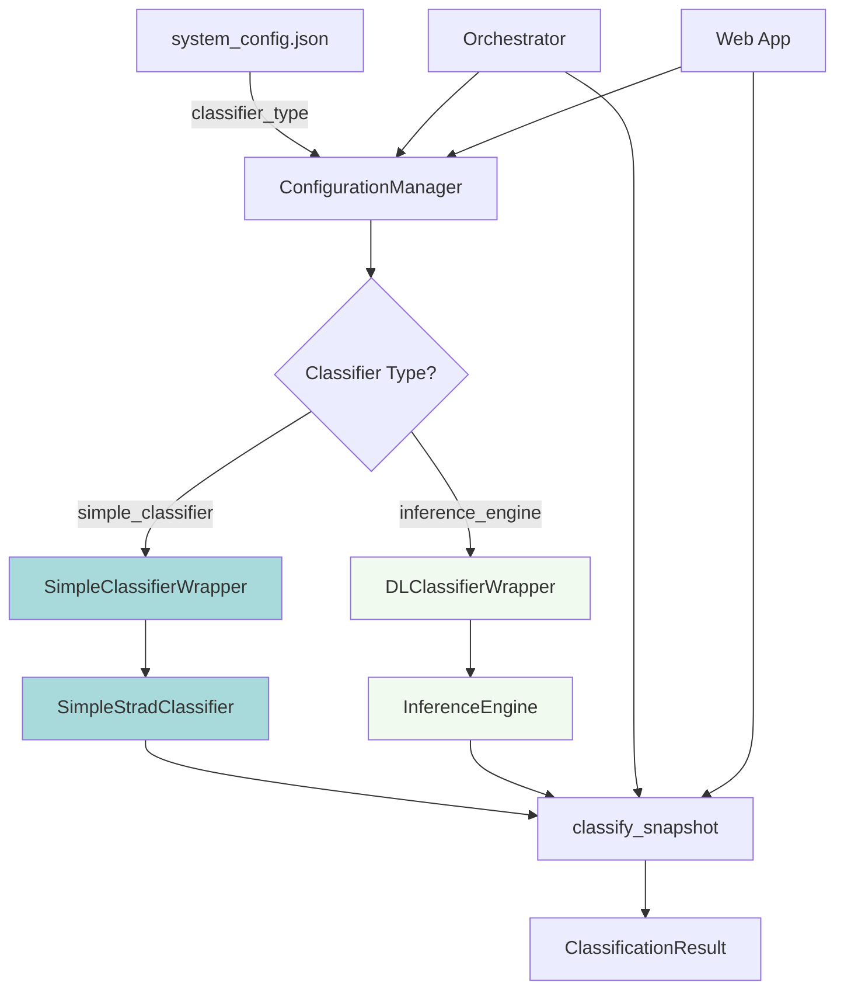

# Design Document: Simple Classifier Integration

## Overview

This feature integrates `SimpleClassifierWrapper` as an alternative classifier loading mechanism for the strad monitoring system. The current system uses `DLClassifierWrapper` with `InferenceEngine`, which expects checkpoints in a specific format (`feature_extractor_state` key) and has limitations on CPU-only devices. The new integration provides:

1. **Configuration-based classifier selection** - System administrators can choose between `'simple_classifier'` and `'inference_engine'` via `system_config.json`
2. **Checkpoint compatibility** - Supports models trained with `train_strad_classifier.py` that save weights with the `model_state_dict` key
3. **Device flexibility** - Properly handles CPU/GPU deployment using PyTorch's `map_location` parameter
4. **Interface compatibility** - Maintains the same `classify_snapshot()` API as `DLClassifierWrapper` for seamless integration

### Why This Integration?

The monitoring system currently has a mismatch between training and deployment:

- **Training Script**: `train_strad_classifier.py` saves checkpoints with `model_state_dict` key
- **Deployment System**: `DLClassifierWrapper` → `InferenceEngine` expects `feature_extractor_state` key
- **Result**: Trained models cannot be deployed without manual checkpoint conversion

Additionally, `InferenceEngine` has device-handling issues that prevent CPU-only deployment, limiting deployment to CUDA-enabled machines.

`SimpleClassifierWrapper` solves these problems by:
- Loading checkpoints directly from the training script format
- Using proper `map_location` for cross-device compatibility
- Providing a lightweight alternative to the complex `InferenceEngine`


## Architecture

### Component Diagram



### Design Principles

1. **Minimal Changes to Existing Code**: Both `orchestrator.py` and `app.py` only need conditional instantiation logic
2. **Configuration-Driven**: Classifier selection happens at configuration time, not runtime
3. **Interface Compatibility**: Both wrappers return `ClassificationResult` objects with identical structure
4. **Fail-Safe Defaults**: System defaults to `inference_engine` for backward compatibility
5. **Graceful Degradation**: Testing mode allows missing models without blocking other components


## Components and Interfaces

### 1. SystemConfig Extension

**Location**: `src/strad_monitoring/config/system_config.py`

**Changes**: Add new field to `SystemConfig` dataclass

```python
@dataclass
class SystemConfig:
    # ... existing fields ...
    
    # Classifier configuration (new)
    classifier_type: str = 'inference_engine'  # 'simple_classifier' or 'inference_engine'
```

**Validation**: Update `ConfigurationManager.validate_config()` to check valid values:

```python
# In validate_config()
valid_classifier_types = ['simple_classifier', 'inference_engine']
if config.classifier_type not in valid_classifier_types:
    errors.append(
        f"classifier_type must be one of {valid_classifier_types}, "
        f"got: {config.classifier_type}"
    )
```

### 2. Orchestrator Modification

**Location**: `src/strad_monitoring/orchestration/orchestrator.py`

**Current Implementation** (lines ~140-165):

```python
# 4. Initialize DLClassifierWrapper (skip in testing mode if model not available)
try:
    self.logger.info("  Initializing DLClassifierWrapper...")
    
    device = 'cuda' if torch.cuda.is_available() else 'cpu'
    self.logger.info(f"  Using device: {device}")
    
    self.dl_classifier = DLClassifierWrapper(
        model_checkpoint_path=self.config.model_checkpoint_path,
        config=self.config.dl_model_config,
        device=device
    )
    self.logger.info("✓ DLClassifierWrapper initialized")
except Exception as e:
    # ... fallback handling ...
```


**Modified Implementation**:

```python
# 4. Initialize classifier (DLClassifierWrapper or SimpleClassifierWrapper)
try:
    classifier_type = getattr(self.config, 'classifier_type', 'inference_engine')
    self.logger.info(f"  Initializing classifier: {classifier_type}...")
    
    # Auto-detect device
    device = 'cuda' if torch.cuda.is_available() else 'cpu'
    self.logger.info(f"  Using device: {device}")
    
    if classifier_type == 'simple_classifier':
        from ..dl_classifier.simple_classifier_wrapper import SimpleClassifierWrapper
        
        self.dl_classifier = SimpleClassifierWrapper(
            model_checkpoint_path=self.config.model_checkpoint_path,
            device=device,
            image_size=640
        )
        self.logger.info("✓ SimpleClassifierWrapper initialized")
    
    elif classifier_type == 'inference_engine':
        from ..dl_classifier.classifier_wrapper import DLClassifierWrapper
        
        self.dl_classifier = DLClassifierWrapper(
            model_checkpoint_path=self.config.model_checkpoint_path,
            config=self.config.dl_model_config,
            device=device
        )
        self.logger.info("✓ DLClassifierWrapper initialized")
    
    else:
        raise ValueError(
            f"Invalid classifier_type: {classifier_type}. "
            f"Must be 'simple_classifier' or 'inference_engine'"
        )

except Exception as e:
    if self.config.enable_local_testing_mode:
        self.logger.warning(
            f"  ⚠ Classifier initialization failed (testing mode): {e}"
        )
        self.dl_classifier = None
    else:
        self.logger.error(f"  ✗ Classifier initialization failed: {e}")
        raise
```


### 3. Web Application Modification

**Location**: `docs/backend/app.py`

**Current Implementation** (lines ~60-80):

```python
# Initialize DL classifier
try:
    device = 'cuda' if torch.cuda.is_available() else 'cpu'
    print(f"Using device: {device}")
    
    dl_classifier = DLClassifierWrapper(
        model_checkpoint_path=config.model_checkpoint_path,
        config=config.dl_model_config,
        device=device
    )
    print("✓ DL classifier initialized")
except Exception as e:
    print(f"⚠ DL classifier not available: {e}")
```

**Modified Implementation**:

```python
# Initialize classifier based on configuration
try:
    classifier_type = getattr(config, 'classifier_type', 'inference_engine')
    device = 'cuda' if torch.cuda.is_available() else 'cpu'
    print(f"Using classifier: {classifier_type}, device: {device}")
    
    if classifier_type == 'simple_classifier':
        from strad_monitoring.dl_classifier.simple_classifier_wrapper import SimpleClassifierWrapper
        
        dl_classifier = SimpleClassifierWrapper(
            model_checkpoint_path=config.model_checkpoint_path,
            device=device,
            image_size=640
        )
        print("✓ SimpleClassifierWrapper initialized")
    
    elif classifier_type == 'inference_engine':
        from strad_monitoring.dl_classifier.classifier_wrapper import DLClassifierWrapper
        
        dl_classifier = DLClassifierWrapper(
            model_checkpoint_path=config.model_checkpoint_path,
            config=config.dl_model_config,
            device=device
        )
        print("✓ DLClassifierWrapper initialized")
    
    else:
        raise ValueError(f"Invalid classifier_type: {classifier_type}")

except Exception as e:
    print(f"⚠ Classifier not available: {e}")
    dl_classifier = None
```


**API Endpoint Update** (`/api/model/status`):

```python
@app.route('/api/model/status', methods=['GET'])
def model_status():
    """Check if model is loaded and ready"""
    classifier_type = getattr(config, 'classifier_type', 'inference_engine') if config else 'unknown'
    
    return jsonify({
        'model_loaded': dl_classifier is not None,
        'classifier_type': classifier_type,
        'model_type': 'strad_monitoring' if dl_classifier else 'mock',
        'ready': True,
        'database_connected': db_interface is not None,
        'strad_monitoring_available': STRAD_MONITORING_AVAILABLE
    })
```

### 4. SimpleClassifierWrapper Interface

**Location**: `src/strad_monitoring/dl_classifier/simple_classifier_wrapper.py`

The existing implementation already provides the required interface. Key aspects:

**Constructor**:
```python
def __init__(
    self,
    model_checkpoint_path: str,
    device: str = 'cpu',
    image_size: int = 640
):
```

**Classification Method**:
```python
def classify_snapshot(self, image: np.ndarray) -> ClassificationResult:
    """
    Classify a snapshot image.
    
    Args:
        image: Input image (H, W, C) in RGB format, uint8
        
    Returns:
        ClassificationResult with severity and confidence
    """
```

**Return Type**:
```python
@dataclass
class ClassificationResult:
    severity: str  # 'none', 'moderate', or 'critical'
    confidence: float  # 0.0 to 1.0
    processing_time_ms: float
    model_name: str
    threshold_used: float
```


**Enhancement Needed**: Add `raw_output` field to match `DLClassifierWrapper` interface:

```python
@dataclass
class ClassificationResult:
    severity: str
    confidence: float
    processing_time_ms: float
    raw_output: Dict  # Add this field
```

Update `classify_snapshot()` to populate `raw_output`:

```python
def classify_snapshot(self, image: np.ndarray) -> ClassificationResult:
    start_time = time.time()
    
    # Preprocess
    input_tensor = self._preprocess_image(image)
    
    # Inference
    with torch.no_grad():
        outputs = self.model(input_tensor)
        probabilities = torch.softmax(outputs, dim=1)
        confidence, predicted = probabilities.max(1)
    
    # Get results
    severity = self.class_names[predicted.item()]
    confidence_score = confidence.item()
    processing_time = (time.time() - start_time) * 1000  # ms
    
    # Build raw output dictionary
    raw_output = {
        'model_name': 'SimpleStradClassifier',
        'device': str(self.device),
        'image_size': self.image_size,
        'preprocessing_time_ms': processing_time * 0.1,  # Estimate
        'class_probabilities': {
            self.class_names[i]: probabilities[0][i].item()
            for i in range(len(self.class_names))
        }
    }
    
    return ClassificationResult(
        severity=severity,
        confidence=confidence_score,
        processing_time_ms=processing_time,
        raw_output=raw_output
    )
```


## Data Models

### Configuration Schema

**File**: `system_config.json`

```json
{
  "_comment": "Classifier Configuration",
  "classifier_type": "simple_classifier",
  "_classifier_type_options": [
    "simple_classifier - For models trained with train_strad_classifier.py",
    "inference_engine - For multi-camera misalignment detector models (default)"
  ],
  
  "model_checkpoint_path": "models/strad_classifier_best.pth",
  
  "_dl_model_config_comment": "Only used when classifier_type='inference_engine'",
  "dl_model_config": {
    "target_resolution": [640, 640],
    "flow_network": "liteflownet2",
    "confidence_threshold": 0.5,
    "enable_uncertainty": false,
    "none_threshold": 0.3,
    "moderate_threshold": 0.7
  }
}
```

### ClassificationResult Compatibility

Both `DLClassifierWrapper` and `SimpleClassifierWrapper` return `ClassificationResult` objects.

**DLClassifierWrapper Result**:
```python
ClassificationResult(
    severity='moderate',
    confidence=0.67,
    processing_time_ms=45.3,
    raw_output={
        'camera_id': 'strad_camera',
        'probability': 0.67,
        'pose': {...},
        'severity_level': 'MODERATE',
        'has_uncertainty': False,
        'model_version': '1.0',
        'architecture': 'multi_camera'
    }
)
```

**SimpleClassifierWrapper Result**:
```python
ClassificationResult(
    severity='moderate',
    confidence=0.67,
    processing_time_ms=23.1,
    raw_output={
        'model_name': 'SimpleStradClassifier',
        'device': 'cpu',
        'image_size': 640,
        'preprocessing_time_ms': 2.3,
        'class_probabilities': {
            'none': 0.15,
            'moderate': 0.67,
            'critical': 0.18
        }
    }
)
```

**Common Interface** (used by orchestrator/web app):
- `severity`: string ∈ {'none', 'moderate', 'critical'}
- `confidence`: float ∈ [0.0, 1.0]
- `processing_time_ms`: float > 0
- `raw_output`: dict (content varies by implementation)


## Error Handling

### 1. Configuration Validation Errors

**Trigger**: Invalid `classifier_type` value in `system_config.json`

**Handling**:
```python
# In ConfigurationManager.validate_config()
valid_types = ['simple_classifier', 'inference_engine']
if config.classifier_type not in valid_types:
    errors.append(
        f"classifier_type must be one of {valid_types}, "
        f"got '{config.classifier_type}'"
    )
```

**User Experience**: System fails fast at startup with clear error message before attempting to load models.

### 2. Checkpoint Format Mismatch

**Trigger**: Loading InferenceEngine checkpoint with SimpleClassifierWrapper (or vice versa)

**Handling in SimpleClassifierWrapper**:
```python
def _load_model(self):
    checkpoint = torch.load(
        self.model_checkpoint_path,
        map_location=self.device
    )
    
    # Validate checkpoint format
    if 'model_state_dict' not in checkpoint:
        raise KeyError(
            f"Checkpoint at {self.model_checkpoint_path} does not contain "
            f"'model_state_dict' key. This wrapper expects checkpoints from "
            f"train_strad_classifier.py. If this is an InferenceEngine checkpoint, "
            f"set classifier_type='inference_engine' in system_config.json"
        )
    
    model = SimpleStradClassifier(num_classes=3).to(self.device)
    model.load_state_dict(checkpoint['model_state_dict'])
    
    return model
```

**User Experience**: Clear error message explaining the issue and suggesting the fix.

### 3. Missing Checkpoint File

**Trigger**: Checkpoint path points to non-existent file

**Handling**:
```python
# In both orchestrator.py and app.py initialization
try:
    if not Path(config.model_checkpoint_path).exists():
        raise FileNotFoundError(
            f"Model checkpoint not found: {config.model_checkpoint_path}"
        )
    
    # ... classifier initialization ...

except FileNotFoundError as e:
    if config.enable_local_testing_mode:
        logger.warning(f"⚠ {e} (testing mode - using mock classifier)")
        dl_classifier = None
    else:
        logger.error(f"✗ {e}")
        raise
```

**User Experience**: In testing mode, system continues with mock classifier. In production mode, system fails with clear error.


### 4. CUDA Unavailability

**Trigger**: `device='cuda'` specified but CUDA not available

**Handling**:
```python
# In orchestrator.py and app.py
device = 'cuda' if torch.cuda.is_available() else 'cpu'

if device == 'cpu':
    logger.info("CUDA not available, using CPU for inference")
```

**Alternative Approach** (strict mode):
```python
device = config.get('device', 'auto')

if device == 'cuda' and not torch.cuda.is_available():
    raise RuntimeError(
        "CUDA device requested but not available. "
        "Set device='cpu' or install CUDA support."
    )
elif device == 'auto':
    device = 'cuda' if torch.cuda.is_available() else 'cpu'
```

**User Experience**: System automatically falls back to CPU with a log message. No manual intervention needed.

### 5. Invalid Image Format

**Trigger**: Image passed to `classify_snapshot()` has wrong shape/dtype

**Handling in SimpleClassifierWrapper**:
```python
def classify_snapshot(self, image: np.ndarray) -> ClassificationResult:
    # Validate input
    if not isinstance(image, np.ndarray):
        raise ValueError(
            f"Expected numpy array, got {type(image)}"
        )
    
    if image.ndim != 3:
        raise ValueError(
            f"Expected 3D array (H, W, C), got shape {image.shape}"
        )
    
    if image.shape[2] != 3:
        raise ValueError(
            f"Expected 3 channels (RGB), got {image.shape[2]}"
        )
    
    # Continue with preprocessing...
```

**User Experience**: Clear error message indicating expected format. Helps developers debug integration issues.

### 6. Slow Processing Performance

**Trigger**: Classification takes longer than 10 seconds

**Handling**:
```python
# In orchestrator.py after classification
if result.processing_time_ms > 10000:
    logger.warning(
        f"Classification for {strad_id} took {result.processing_time_ms:.1f}ms, "
        f"exceeding 10-second target. Consider using GPU acceleration."
    )
```

**User Experience**: System continues but logs performance warning to alert operators to potential issues.


## Testing Strategy

### Unit Tests

**Test File**: `tests/test_simple_classifier_integration.py`

#### Test Suite 1: Configuration Validation
- ✓ Test valid `classifier_type` values accepted
- ✓ Test invalid `classifier_type` rejected with clear error
- ✓ Test default value (`inference_engine`) used when field missing
- ✓ Test configuration loads successfully with both classifier types

#### Test Suite 2: SimpleClassifierWrapper
- ✓ Test checkpoint loading with valid `model_state_dict`
- ✓ Test error on missing `model_state_dict` key
- ✓ Test device parameter (CPU/GPU)
- ✓ Test `map_location` handles cross-device loading
- ✓ Test `classify_snapshot()` with valid RGB image
- ✓ Test error on invalid image shape/dtype
- ✓ Test `ClassificationResult` contains all required fields
- ✓ Test `raw_output` dictionary structure

#### Test Suite 3: Orchestrator Integration
- ✓ Test orchestrator initializes `SimpleClassifierWrapper` when `classifier_type='simple_classifier'`
- ✓ Test orchestrator initializes `DLClassifierWrapper` when `classifier_type='inference_engine'`
- ✓ Test orchestrator handles missing checkpoint in testing mode
- ✓ Test orchestrator fails on missing checkpoint in production mode
- ✓ Test classifier is used in `process_single_strad()` workflow
- ✓ Test error handling propagates correctly

#### Test Suite 4: Web App Integration
- ✓ Test web app initializes correct classifier based on configuration
- ✓ Test `/api/model/status` reports correct `classifier_type`
- ✓ Test `/api/inference` endpoint uses configured classifier
- ✓ Test mock mode when classifier is None


### Integration Tests

**Test File**: `tests/integration/test_classifier_integration.py`

#### Integration Test 1: End-to-End Orchestrator Flow
```python
def test_orchestrator_with_simple_classifier():
    """Test full orchestrator cycle with SimpleClassifierWrapper"""
    
    # Setup configuration with simple_classifier
    config = load_test_config(classifier_type='simple_classifier')
    
    # Initialize orchestrator
    orchestrator = MonitoringOrchestrator(config)
    
    # Verify classifier type
    assert isinstance(orchestrator.dl_classifier, SimpleClassifierWrapper)
    
    # Run single strad processing
    result = orchestrator.process_single_strad('SC042')
    
    # Verify result structure
    assert result['success'] == True
    assert 'classification' in result
    assert result['classification'] in ['none', 'moderate', 'critical']
```

#### Integration Test 2: Web App API
```python
def test_web_app_simple_classifier_inference():
    """Test web app inference with SimpleClassifierWrapper"""
    
    # Start app with simple_classifier configuration
    app = create_app(config_path='test_config_simple.json')
    client = app.test_client()
    
    # Test model status endpoint
    response = client.get('/api/model/status')
    data = response.get_json()
    assert data['classifier_type'] == 'simple_classifier'
    assert data['model_loaded'] == True
    
    # Test inference endpoint
    with open('test_snapshot.jpg', 'rb') as f:
        response = client.post(
            '/api/inference',
            data={'image': (f, 'snapshot.jpg')},
            content_type='multipart/form-data'
        )
    
    data = response.get_json()
    assert data['success'] == True
    assert 'classification' in data
    assert 'confidence' in data
```


#### Integration Test 3: Classifier Switching
```python
def test_classifier_switching():
    """Test system works with both classifier types"""
    
    configs = [
        load_test_config(classifier_type='simple_classifier'),
        load_test_config(classifier_type='inference_engine')
    ]
    
    for config in configs:
        orchestrator = MonitoringOrchestrator(config)
        
        # Both should classify successfully
        result = orchestrator.dl_classifier.classify_snapshot(test_image)
        
        assert result.severity in ['none', 'moderate', 'critical']
        assert 0.0 <= result.confidence <= 1.0
        assert result.processing_time_ms > 0
        assert isinstance(result.raw_output, dict)
```

### Manual Testing Checklist

#### Deployment Verification
- [ ] Deploy with `classifier_type='simple_classifier'` on CPU-only laptop
- [ ] Deploy with `classifier_type='simple_classifier'` on GPU workstation
- [ ] Deploy with `classifier_type='inference_engine'` (verify backward compatibility)
- [ ] Test configuration hot-reload (if supported)
- [ ] Verify logging shows correct classifier type and device

#### Performance Testing
- [ ] Measure SimpleClassifierWrapper inference time on CPU
- [ ] Measure SimpleClassifierWrapper inference time on GPU
- [ ] Compare to DLClassifierWrapper performance baseline
- [ ] Verify <10 second target met (or warning logged)

#### Error Scenarios
- [ ] Test with missing checkpoint file (testing mode)
- [ ] Test with missing checkpoint file (production mode)
- [ ] Test with wrong checkpoint format
- [ ] Test with invalid `classifier_type` value
- [ ] Test with corrupted checkpoint file

#### Web App Testing
- [ ] Verify `/api/model/status` reports correct information
- [ ] Test single-image inference through `/api/inference`
- [ ] Verify response times are reasonable
- [ ] Test with mock mode (no classifier loaded)


## Correctness Properties

*A property is a characteristic or behavior that should hold true across all valid executions of a system—essentially, a formal statement about what the system should do. Properties serve as the bridge between human-readable specifications and machine-verifiable correctness guarantees.*

### Property Reflection

After analyzing all acceptance criteria, the following properties emerged. Several redundancies were identified and consolidated:

**Redundancies Eliminated:**
- Requirements 1.3, 1.4, 6.2, 6.3 all test the same conditional instantiation logic → consolidated into Property 1
- Requirements 7.2, 7.3 test the same logic for web app → consolidated into Property 2  
- Requirements 2.4 and 2.5 test checkpoint key validation → combined into Property 3
- Requirements 9.3 and 9.4 test error cases → covered by consolidated properties
- Multiple logging requirements (10.1-10.3) are SMOKE tests, not properties
- Documentation requirements (12.1-12.5) are SMOKE tests, not properties


### Property 1: Classifier Type Determines Wrapper Instance

*For any* valid configuration with `classifier_type` set to either `'simple_classifier'` or `'inference_engine'`, the orchestrator SHALL instantiate the corresponding wrapper type (SimpleClassifierWrapper or DLClassifierWrapper respectively)

**Validates: Requirements 1.3, 1.4, 6.2, 6.3**

### Property 2: Web App Uses Same Classifier Selection Logic

*For any* valid configuration with `classifier_type` set to either `'simple_classifier'` or `'inference_engine'`, the web application SHALL instantiate the same wrapper type as the orchestrator would for that configuration

**Validates: Requirements 1.5, 7.2, 7.3**

### Property 3: Checkpoint Format Validation

*For any* checkpoint file, loading with SimpleClassifierWrapper SHALL succeed if and only if the checkpoint contains a `'model_state_dict'` key, and SHALL raise a descriptive KeyError otherwise

**Validates: Requirements 2.4, 2.5, 9.4**

### Property 4: Cross-Device Checkpoint Loading

*For any* valid checkpoint file trained on any device (CPU or CUDA), SimpleClassifierWrapper SHALL successfully load it on any other device when initialized with the appropriate `device` parameter

**Validates: Requirements 2.3, 3.1**

### Property 5: Configuration Validation Rejects Invalid Types

*For any* string value not in the set `{'simple_classifier', 'inference_engine'}`, configuration validation SHALL reject it and raise a ValueError with a descriptive message

**Validates: Requirements 1.1, 9.1**


### Property 6: Classification Result Structure Completeness

*For any* valid RGB image passed to `classify_snapshot()`, the returned ClassificationResult SHALL contain all required fields (`severity`, `confidence`, `processing_time_ms`, `raw_output`) with correct types and value constraints

**Validates: Requirements 4.3, 4.4, 4.5, 4.6, 4.7**

Specifically:
- `severity` ∈ `{'none', 'moderate', 'critical'}`
- `confidence` ∈ `[0.0, 1.0]`
- `processing_time_ms` > 0
- `raw_output` is a dictionary

### Property 7: Image Preprocessing Consistency

*For any* input image with shape `(H, W, 3)` and dtype `uint8`, the SimpleClassifierWrapper preprocessing SHALL produce a tensor with shape `(1, 3, 640, 640)`, values in range approximately `[-3, 3]` (after ImageNet normalization), and located on the configured device

**Validates: Requirements 5.1, 5.2, 5.3, 5.4, 5.5**

### Property 8: Valid Image Acceptance

*For any* numpy array with shape `(H, W, 3)` where `H >= 240`, `W >= 320`, and dtype `uint8`, the `classify_snapshot()` method SHALL accept it and return a valid ClassificationResult

**Validates: Requirements 4.2**

### Property 9: Invalid Image Rejection

*For any* input that is not a 3D numpy array with 3 channels or has incorrect dtype, the `classify_snapshot()` method SHALL raise a ValueError with a descriptive error message indicating the expected format

**Validates: Requirements 9.5**


### Property 10: Error Handling Consistency Between Wrappers

*For any* error that can occur during classification (e.g., model failure, preprocessing error), both SimpleClassifierWrapper and DLClassifierWrapper SHALL be handled identically by the orchestrator (logged and execution continues with remaining strads)

**Validates: Requirements 6.5**

### Property 11: API Endpoint Reports Correct Classifier Type

*For any* valid configuration, the `/api/model/status` endpoint SHALL return a JSON response with a `classifier_type` field that matches the value in the system configuration

**Validates: Requirements 7.5**

### Property 12: Raw Output Contains Required Diagnostic Fields

*For any* successful classification by SimpleClassifierWrapper, the `raw_output` dictionary SHALL contain keys: `model_name`, `device`, `image_size`, and `class_probabilities`

**Validates: Requirements 10.5**

### Property 13: Missing Checkpoint Handling in Testing Mode

*For any* configuration with `enable_local_testing_mode=True`, if the model checkpoint file does not exist, the orchestrator and web app SHALL initialize with `classifier=None` and log a warning, rather than raising an error

**Validates: Requirements 8.1, 8.4**

### Property 14: File Not Found Error in Production Mode

*For any* configuration with `enable_local_testing_mode=False`, if the model checkpoint file does not exist at the specified path, the system SHALL raise a FileNotFoundError with the full path during initialization

**Validates: Requirements 9.3**


### Property 15: Backward Compatibility Default

*For any* configuration that does not specify a `classifier_type` field, the system SHALL default to `'inference_engine'` to maintain backward compatibility with existing deployments

**Validates: Requirements 11.1**

---

## Implementation Notes

### Properties vs Examples vs Smoke Tests

This feature includes a mix of testable properties, specific example-based tests, and smoke tests:

**Property-Based Tests** (Properties 1-15): Universal behaviors that hold across all valid inputs, suitable for property-based testing with randomized input generation.

**Example-Based Tests**: Specific scenarios like:
- Testing with a specific checkpoint file format
- Testing on a specific device configuration  
- Testing API endpoints with fixed request payloads

**Smoke Tests**: One-time checks like:
- Verifying documentation exists and contains required information
- Checking that log messages appear during initialization
- Confirming example configuration files are present

### Test Coverage Strategy

Each property should be implemented as a property-based test running 100+ iterations with randomized inputs where applicable. For example:

- **Property 5**: Generate 100 random strings, verify only 2 specific values pass validation
- **Property 6**: Generate 100 random valid images, verify all return complete results
- **Property 8**: Generate 100 random image dimensions/values, verify acceptance
- **Property 9**: Generate 100 random invalid inputs, verify rejection with clear errors

This approach ensures comprehensive coverage beyond what example-based tests can provide.


## Deployment and Configuration

### Migration Path for Existing Deployments

**Scenario 1: Currently using InferenceEngine, want to continue**
- No changes needed
- System defaults to `classifier_type='inference_engine'`
- Existing checkpoints continue to work

**Scenario 2: Want to use SimpleClassifierWrapper with new model**
1. Train model using `train_strad_classifier.py`
2. Update `system_config.json`:
   ```json
   {
     "classifier_type": "simple_classifier",
     "model_checkpoint_path": "path/to/trained_model.pth"
   }
   ```
3. Restart orchestrator and web app
4. Verify in logs: "✓ SimpleClassifierWrapper initialized"

**Scenario 3: Testing new classifier alongside existing**
1. Create second configuration file: `system_config_simple.json`
2. Run web app with new config for testing
3. Keep orchestrator running with existing config
4. Switch when confident in new model performance

### Configuration Examples

**Example 1: SimpleClassifier on CPU**
```json
{
  "classifier_type": "simple_classifier",
  "model_checkpoint_path": "models/strad_classifier_cpu.pth",
  "enable_local_testing_mode": false,
  
  "_comment": "Other fields omitted for brevity"
}
```

**Example 2: InferenceEngine on GPU (backward compatible)**
```json
{
  "classifier_type": "inference_engine",
  "model_checkpoint_path": "models/multi_camera_model.pth",
  "dl_model_config": {
    "target_resolution": [640, 640],
    "flow_network": "liteflownet2",
    "enable_uncertainty": true
  }
}
```

**Example 3: Testing mode with missing model**
```json
{
  "classifier_type": "simple_classifier",
  "model_checkpoint_path": "models/not_yet_trained.pth",
  "enable_local_testing_mode": true,
  
  "_comment": "System will use mock classifier"
}
```


## Performance Considerations

### Inference Speed Comparison

**Expected Performance** (based on architecture analysis):

| Classifier Type | Device | Typical Inference Time | Notes |
|----------------|--------|----------------------|-------|
| SimpleClassifierWrapper | GPU | 20-50 ms | Single forward pass, no optical flow |
| SimpleClassifierWrapper | CPU | 100-300 ms | Acceptable for hourly monitoring |
| DLClassifierWrapper | GPU | 200-500 ms | Includes optical flow computation |
| DLClassifierWrapper | CPU | 2000-5000 ms | May exceed 10-second target |

**Key Differences:**
- SimpleClassifierWrapper: Single CNN forward pass (640x640 → 3 classes)
- DLClassifierWrapper: Multi-stage pipeline (4 cameras, optical flow, fusion)

### Memory Usage

**SimpleClassifierWrapper:**
- Model size: ~15 MB (4 conv layers + 2 FC layers)
- Peak memory (inference): ~200 MB (batch=1, GPU)
- Suitable for laptop deployment

**DLClassifierWrapper:**
- Model size: ~100 MB (feature extractor + flow network)
- Peak memory (inference): ~1.5 GB (4-camera batch, GPU)
- Requires workstation-class hardware

### Optimization Recommendations

1. **For CPU deployment**: Use SimpleClassifierWrapper
2. **For GPU deployment**: Both work, SimpleClassifierWrapper is faster
3. **For maximum accuracy**: Use DLClassifierWrapper with uncertainty estimation
4. **For rapid iteration**: Use SimpleClassifierWrapper for faster training cycles


## Security and Validation

### Input Validation

1. **Configuration File**
   - Validate `classifier_type` against whitelist
   - Check file paths for directory traversal attempts
   - Verify checkpoint files before loading with PyTorch

2. **Image Inputs**
   - Validate array dimensions and dtype
   - Reject excessively large images (>10MB)
   - Sanitize file paths in web API

3. **Checkpoint Files**
   - Verify file extension (.pth)
   - Check file size is reasonable (<500MB)
   - Use `torch.load(..., map_location=...)` to prevent device errors

### Error Handling Strategy

**Fail-Fast Errors** (initialization):
- Invalid `classifier_type` in configuration
- Missing required configuration fields
- Checkpoint file not found (production mode)
- Invalid checkpoint format

**Graceful Degradation** (runtime):
- Classification timeout → log warning, return mock result
- Preprocessing error → log error, skip strad
- Model inference error → log error, continue with remaining strads

**Testing Mode** (enable_local_testing_mode=True):
- Missing checkpoint → use mock classifier
- Database unavailable → use fallback data
- Component failure → log warning, continue execution


## Monitoring and Logging

### Initialization Logging

```
[INFO] Initializing classifier: simple_classifier...
[INFO] Using device: cpu
[INFO] Loading checkpoint: models/strad_classifier_best.pth
[INFO] ✓ SimpleClassifierWrapper initialized
[INFO]   Model: SimpleStradClassifier
[INFO]   Device: cpu
[INFO]   Image size: 640x640
```

### Classification Logging

```
[INFO] Processing strad 1/10: SC042
[INFO] Classification complete: severity=moderate, confidence=0.67, time=45.3ms
[INFO] ✓ SC042 processed successfully: moderate (confidence: 0.67, time: 2.1s)
```

### Error Logging

```
[ERROR] Failed to load checkpoint: KeyError('model_state_dict')
[ERROR] Checkpoint at models/wrong_format.pth does not contain 'model_state_dict' key.
[ERROR] This wrapper expects checkpoints from train_strad_classifier.py.
[ERROR] If this is an InferenceEngine checkpoint, set classifier_type='inference_engine'
```

### Performance Logging

```
[WARNING] Classification for SC099 took 12345.6ms, exceeding 10-second target.
[WARNING] Consider using GPU acceleration or reducing image resolution.
```

### Metrics to Track

1. **Initialization**
   - Classifier type selected
   - Device used (CPU/GPU)
   - Checkpoint load time
   - Model memory usage

2. **Runtime**
   - Classifications per hour
   - Average inference time
   - Peak inference time
   - Timeout/error rate

3. **Errors**
   - Checkpoint loading failures
   - Preprocessing errors
   - Classification timeouts
   - Device errors (OOM, CUDA errors)


## Future Enhancements

### Potential Extensions

1. **Hot-Swapping Classifiers**
   - Allow classifier change without system restart
   - Useful for A/B testing different models
   - Requires thread-safe model loading

2. **Ensemble Classification**
   - Run both classifiers and combine predictions
   - Higher accuracy at cost of latency
   - Useful for high-stakes decisions

3. **Model Versioning**
   - Track which model version produced each result
   - Support rollback to previous model
   - Compare model performance over time

4. **Automatic Device Selection**
   - Benchmark both CPU and GPU at startup
   - Select faster device automatically
   - Fall back to CPU if GPU fails

5. **Batch Processing Mode**
   - Process multiple strads in parallel on GPU
   - Reduce per-strad overhead
   - Requires architectural changes to orchestrator

### Backward Compatibility Plan

The design maintains backward compatibility by:

1. **Default to InferenceEngine**: Existing deployments without `classifier_type` continue working
2. **No API changes**: Both wrappers implement same interface
3. **No database schema changes**: ClassificationResult structure unchanged
4. **No removal of existing code**: DLClassifierWrapper remains fully functional

### Deprecation Strategy (Future)

If SimpleClassifierWrapper proves superior, future deprecation could follow this timeline:

- **Phase 1** (Current): Both classifiers supported equally
- **Phase 2** (6 months): SimpleClassifierWrapper becomes default
- **Phase 3** (12 months): InferenceEngine marked deprecated in documentation
- **Phase 4** (18 months): InferenceEngine support removed (major version bump)

This is not part of current implementation but provides a path forward if needed.


## Summary

This design integrates SimpleClassifierWrapper as a configuration-driven alternative to DLClassifierWrapper/InferenceEngine for the strad monitoring system. The key design decisions are:

1. **Minimal Code Changes**: Only orchestrator.py and app.py need modification (conditional instantiation logic)
2. **Configuration-Driven**: Classifier selection via `classifier_type` field in system_config.json
3. **Interface Compatibility**: Both wrappers return identical ClassificationResult structure
4. **Backward Compatible**: Defaults to InferenceEngine when classifier_type not specified
5. **Graceful Fallback**: Testing mode allows missing models without blocking other components
6. **Clear Error Messages**: Checkpoint format mismatches provide actionable guidance

The implementation enables:
- Deployment of models trained with train_strad_classifier.py
- CPU-only deployment for laptops and edge devices
- Faster inference for simple single-camera classification
- Easier experimentation with different model architectures

The design maintains full backward compatibility while providing a simpler, more flexible deployment option for production use.

