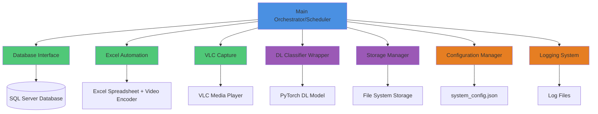
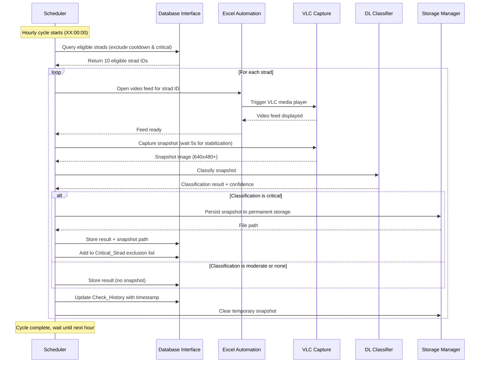

# Design Document: Strad Carrier Monitoring Automation

## Overview

This design document specifies the technical architecture for an automated monitoring system that integrates deep learning camera misalignment detection with SQL Server database operations, Excel-based video feed automation, and VLC media player snapshot capture. The system orchestrates hourly monitoring cycles of randomly selected Strad Carriers (10 from a pool of 135 units), classifies camera alignment, and manages check history with cooldown periods and critical unit exclusion.

### System Purpose

The monitoring system automates what was previously a manual process of checking camera alignment on Strad Carrier vehicles. By integrating existing deep learning classification models with production databases and video infrastructure, the system provides continuous fleet-wide monitoring without human intervention.

### Key Design Goals

1. **Automation**: Eliminate manual intervention in the monitoring cycle (selection, video feed access, snapshot capture, classification)
2. **Integration**: Seamlessly connect SQL Server, Excel video encoders, VLC media player, and PyTorch DL models
3. **Reliability**: Handle failures gracefully, maintain check history integrity, ensure critical units receive priority attention
4. **Efficiency**: Complete 10-unit cycles within 50 minutes, manage memory resources effectively
5. **Maintainability**: Externalize configuration, provide comprehensive logging, support deployment across environments

### High-Level Architecture

The system consists of 8 primary components organized in a layered architecture:

**Orchestration Layer:**
- Main Scheduler/Orchestrator

**Interface Layer:**
- Database Interface (SQL Server)
- Excel Automation Interface
- VLC Capture Interface

**Processing Layer:**
- DL Classifier Wrapper
- Storage Manager

**Foundation Layer:**
- Configuration Manager
- Logging System


## Architecture

### Component Diagram



### Data Flow Diagram




### Technology Stack

| Component | Technology | Rationale |
|-----------|------------|-----------|
| Language | Python 3.10+ | Integrates with existing PyTorch DL models; excellent library support for SQL Server, Excel COM, window automation |
| Database Driver | `pyodbc` or `pymssql` | Industry standard for SQL Server connectivity from Python; supports parameterized queries |
| Excel Automation | `win32com.client` (pywin32) | Direct COM automation for Excel; reliable control of ActiveX controls like the video encoder button |
| Window Automation | `pyautogui` + `win32gui` | Screenshot capture from VLC window; lightweight and reliable for snapshot extraction |
| Scheduler | `APScheduler` | Robust Python scheduling with cron-like syntax; handles hourly triggers and failure recovery |
| DL Framework | PyTorch 2.0+ | Already used by existing misalignment detection models (LiteFlowNet2/SpyNet) |
| Configuration | JSON | Simple, human-readable format for deployment configuration |
| Logging | Python `logging` module | Built-in, configurable, supports rotation and multiple handlers |
| Storage | File system + SQLite (optional) | File system for snapshots; SQLite for local Check_History cache (reduces SQL Server load) |

### Deployment Environment

- **Platform**: Windows 10/11 (required for Excel COM automation and VLC)
- **Python**: 3.10 or 3.11 (compatibility with PyTorch 2.0+)
- **GPU**: NVIDIA GPU with CUDA 11.7+ (for DL inference)
- **Memory**: 16GB RAM minimum (8GB for DL models, 8GB for system operations)
- **Storage**: 100GB minimum (snapshot persistence, logs, model checkpoints)
- **Network**: Access to SQL Server database server and video encoder infrastructure


## Components and Interfaces

### 1. Main Orchestrator/Scheduler

**Purpose**: Coordinates the end-to-end monitoring cycle, manages component lifecycle, handles errors and retries.

**Responsibilities**:
- Schedule hourly monitoring cycles using APScheduler
- Query database for eligible strads
- Coordinate serial processing of 10 strads per cycle
- Handle component failures with retry logic
- Ensure cycle completion within 50 minutes
- Report cycle statistics

**Interface**:
```python
class MonitoringOrchestrator:
    def __init__(self, config: SystemConfig):
        """Initialize orchestrator with configuration."""
        
    def start(self) -> None:
        """Start hourly scheduling (blocking call)."""
        
    def stop(self) -> None:
        """Stop scheduler and cleanup resources."""
        
    def run_cycle(self) -> CycleResult:
        """Execute one monitoring cycle (10 strads)."""
        
    def process_single_strad(self, strad_id: str) -> StradResult:
        """Process one strad: capture, classify, store."""
        
    def get_statistics(self) -> Dict:
        """Get orchestrator runtime statistics."""
```

**Key Implementation Details**:
- Uses APScheduler with `CronTrigger` for hourly execution (trigger="cron", hour="*", minute=0, second=0)
- Maintains cycle state in memory (current strad, progress counter)
- Implements circuit breaker pattern for component failures
- Tracks timing: total cycle time, per-strad time, component-level timing
- Handles graceful shutdown on SIGTERM/SIGINT


### 2. Database Interface

**Purpose**: Manage all SQL Server interactions including strad selection, result storage, check history, and critical exclusion list.

**Responsibilities**:
- Query eligible strads with cooldown and exclusion filtering
- Store classification results with timestamps
- Maintain Check_History table
- Manage Critical_Strad exclusion list
- Handle database connection pooling and retry logic

**Interface**:
```python
class DatabaseInterface:
    def __init__(self, connection_string: str, enable_fallback: bool = True, fallback_data_path: str = None):
        """
        Initialize database connection with fallback support.
        
        Args:
            connection_string: SQL Server connection string
            enable_fallback: Enable local testing mode when database unavailable
            fallback_data_path: Path to local test data (KITTI dataset or local folder)
        """
        
    def get_eligible_strads(self, count: int = 10) -> List[str]:
        """
        Query eligible strads excluding:
        - Strads checked within last 1 hour
        - Strads in Critical_Strad exclusion list
        Returns up to 'count' strad IDs.
        
        FALLBACK MECHANISM:
        - Primary: Calls SQL Server stored procedure 'strad_action_check_by_id_and_timestamp'
        - Fallback: If SQL Server unavailable, generates test strad IDs from KITTI dataset or local folder
        - Configuration flag 'enable_local_testing_mode' controls fallback behavior
        """
        
    def store_classification_result(
        self, 
        strad_id: str, 
        classification: str, 
        confidence: float,
        snapshot_path: Optional[str] = None
    ) -> None:
        """Store classification result in database."""
        
    def update_check_history(self, strad_id: str, timestamp: datetime) -> None:
        """Record check timestamp in Check_History."""
        
    def add_to_critical_exclusion(self, strad_id: str) -> None:
        """Add strad to Critical_Strad exclusion list."""
        
    def remove_from_critical_exclusion(self, strad_id: str) -> None:
        """Remove strad from Critical_Strad exclusion list (after adjustment confirmation)."""
        
    def cleanup_old_history(self, days: int = 7) -> int:
        """Remove Check_History records older than specified days."""
        
    def health_check(self) -> bool:
        """Verify database connectivity."""
```


**Database Schema**:

The interface expects these tables to exist:

```sql
-- Table: strad_action_check_by_id_and_timestamp
-- Tracks when each strad was last checked
CREATE TABLE strad_action_check_by_id_and_timestamp (
    strad_id VARCHAR(10) PRIMARY KEY,  -- Format: SCXXX
    last_check_timestamp DATETIME2 NOT NULL,
    INDEX idx_last_check (last_check_timestamp)
);

-- Table: classification_results
-- Stores classification outcomes
CREATE TABLE classification_results (
    id INT IDENTITY(1,1) PRIMARY KEY,
    strad_id VARCHAR(10) NOT NULL,
    classification VARCHAR(20) NOT NULL,  -- 'none', 'moderate', 'critical'
    confidence FLOAT NOT NULL,
    snapshot_path VARCHAR(500),
    created_at DATETIME2 DEFAULT GETDATE(),
    INDEX idx_strad_created (strad_id, created_at)
);

-- Table: critical_strad_exclusions
-- Tracks strads excluded from rotation due to critical classification
CREATE TABLE critical_strad_exclusions (
    strad_id VARCHAR(10) PRIMARY KEY,
    added_at DATETIME2 DEFAULT GETDATE(),
    adjustment_confirmed_at DATETIME2,
    technician_id VARCHAR(50)
);
```

**Key Implementation Details**:
- Uses `pyodbc` with connection pooling (min=2, max=10 connections)
- Implements exponential backoff for transient SQL Server errors (3 retries, backoff: 1s, 2s, 4s)
- Uses parameterized queries to prevent SQL injection
- Stores connection string in encrypted configuration
- Implements query timeout of 30 seconds
- Uses read-committed isolation level for queries, serializable for critical exclusion updates

**CRITICAL: Fallback Mechanism for Local Testing**:
```python
def get_eligible_strads(self, count: int = 10) -> List[str]:
    """
    FALLBACK MECHANISM IMPLEMENTATION:
    This method tries production SQL Server first, then falls back to local test data.
    """
    try:
        # ========================================
        # PRIMARY PATH: Production SQL Server
        # ========================================
        # Calls stored procedure: strad_action_check_by_id_and_timestamp
        # Requires active SQL Server connection with user's Windows credentials
        cursor = self.connection.cursor()
        cursor.execute("EXEC strad_action_check_by_id_and_timestamp @count=?", (count,))
        results = cursor.fetchall()
        logger.info(f"Retrieved {len(results)} eligible strads from SQL Server")
        return [row.strad_id for row in results]
        
    except (pyodbc.Error, ConnectionError) as e:
        # ========================================
        # FALLBACK PATH: Local Testing Mode
        # ========================================
        # Used when SQL Server is unavailable (local testing, network issues, etc.)
        logger.warning(f"SQL Server unavailable: {e}. Using local testing fallback.")
        
        if not self.enable_fallback:
            raise ConnectionError("SQL Server unavailable and fallback disabled")
        
        # Option 1: Load from KITTI dataset
        if self.fallback_data_path and "kitti" in self.fallback_data_path.lower():
            return self._load_strads_from_kitti(count)
        
        # Option 2: Load from local folder with strad list
        elif self.fallback_data_path and os.path.exists(self.fallback_data_path):
            return self._load_strads_from_local_folder(count)
        
        # Option 3: Generate random test strad IDs
        else:
            return self._generate_random_test_strads(count)

def _load_strads_from_kitti(self, count: int) -> List[str]:
    """
    FALLBACK OPTION 1: Load strad IDs from KITTI dataset
    
    This reads from the existing KITTI dataset structure and maps
    KITTI sequences to strad IDs for realistic testing.
    
    Path: kitti_data/ or configured fallback_data_path
    """
    # TODO: Implementation loads KITTI sequences and maps to strad IDs
    pass

def _load_strads_from_local_folder(self, count: int) -> List[str]:
    """
    FALLBACK OPTION 2: Load strad IDs from local CSV/JSON file
    
    Reads from a local file containing test strad IDs with timestamps
    and check history for realistic testing scenarios.
    
    Expected file format:
    strad_id,last_check_timestamp,is_critical
    SC001,2024-01-15 10:00:00,false
    SC042,2024-01-15 11:00:00,true
    ...
    
    Path: Configured in fallback_data_path (e.g., 'C:/test_data/strad_list.csv')
    """
    # TODO: Implementation reads CSV/JSON and applies same filtering logic
    pass

def _generate_random_test_strads(self, count: int) -> List[str]:
    """
    FALLBACK OPTION 3: Generate random test strad IDs
    
    Creates realistic strad IDs (SC001-SC135) for basic testing
    when no local test data is available.
    """
    import random
    all_strads = [f"SC{str(i).zfill(3)}" for i in range(1, 136)]
    selected = random.sample(all_strads, min(count, len(all_strads)))
    logger.info(f"Generated {len(selected)} random test strads: {selected}")
    return selected
```

**Configuration Example**:
```json
{
  "database_connection_string": "DRIVER={ODBC Driver 17 for SQL Server};SERVER=prod-server;DATABASE=StradMonitoring;Trusted_Connection=yes",
  "enable_local_testing_mode": true,
  "fallback_data_path": "C:/test_data/strad_list.csv",
  "fallback_data_source": "local_folder"  // Options: "kitti", "local_folder", "random"
}
```


### 3. Excel Automation Component

**Purpose**: Control Excel spreadsheet containing the "spreader video encoder" ActiveX control to open video feeds for selected strads.

**Responsibilities**:
- Open Excel workbook containing video encoder control
- Locate video encoder button/control
- Input strad ID into control
- Trigger video encoder to launch VLC
- Verify VLC window appears
- Handle Excel application lifecycle

**Interface**:
```python
class ExcelAutomation:
    def __init__(self, excel_file_path: str, timeout_seconds: int = 30):
        """Initialize Excel COM automation."""
        
    def open_video_feed(self, strad_id: str) -> bool:
        """
        Open video feed for given strad ID.
        Returns True if successful, False if timeout/error.
        """
        
    def close_video_feed(self) -> None:
        """Close current video feed."""
        
    def cleanup(self) -> None:
        """Cleanup Excel COM objects."""
```

**Key Implementation Details**:
- Uses `win32com.client.Dispatch("Excel.Application")` for COM automation
- Makes Excel visible=False to avoid UI flickering (only VLC needs to be visible for capture)
- Locates "spreader video encoder" control by name using worksheet.OLEObjects()
- Inputs strad ID using control.Object.Value or control.Object.Text property
- Activates control using control.Object.Click() or similar method
- Polls for VLC window using `win32gui.FindWindow("VLC media player", None)` with 30-second timeout
- Implements COM object cleanup in finally block to prevent Excel process leaks
- Uses `pythoncom.CoInitialize()` for thread safety if running in worker threads


### 4. VLC Capture Component

**Purpose**: Capture snapshots from VLC media player displaying live camera feeds.

**Responsibilities**:
- Wait for feed stabilization (5 seconds)
- Locate VLC window
- Capture screenshot from VLC window
- Validate snapshot dimensions (minimum 640x480)
- Handle VLC window positioning variations
- Implement retry logic for failed captures

**Interface**:
```python
class VLCCapture:
    def __init__(
        self, 
        stabilization_delay: float = 5.0,
        min_width: int = 640,
        min_height: int = 480
    ):
        """Initialize VLC capture settings."""
        
    def capture_snapshot(self) -> np.ndarray:
        """
        Capture snapshot from VLC window.
        Waits for stabilization, then captures.
        Returns numpy array (H, W, 3) in RGB format.
        Raises CaptureError if capture fails after retries.
        """
        
    def validate_snapshot(self, snapshot: np.ndarray) -> bool:
        """Verify snapshot meets minimum dimension requirements."""
```

**Key Implementation Details**:
- Uses `win32gui.FindWindow("VLC media player", None)` to locate VLC window
- Brings VLC window to foreground using `win32gui.SetForegroundWindow(hwnd)`
- Gets window rectangle using `win32gui.GetWindowRect(hwnd)`
- Captures using `pyautogui.screenshot(region=(x, y, width, height))`
- Converts PIL Image to numpy array (RGB format)
- Implements 3 retry attempts with 2-second intervals on capture failure
- Validates dimensions before returning: `assert snapshot.shape[0] >= 480 and snapshot.shape[1] >= 640`
- Handles multi-monitor scenarios by ensuring window is on primary display
- Optional: Use `PIL.ImageGrab.grab()` as fallback if pyautogui fails


### 5. DL Classifier Wrapper

**Purpose**: Integrate existing deep learning misalignment detection models, providing a simplified interface for snapshot classification.

**Responsibilities**:
- Load PyTorch model checkpoint
- Preprocess snapshot images
- Run inference to obtain classification
- Map model output to severity levels (none, moderate, critical)
- Extract confidence scores
- Complete classification within 10 seconds

**Interface**:
```python
@dataclass
class ClassificationResult:
    severity: str  # 'none', 'moderate', 'critical'
    confidence: float  # 0.0 to 1.0
    processing_time_ms: float
    raw_output: Dict  # Model-specific diagnostic data

class DLClassifierWrapper:
    def __init__(
        self, 
        model_checkpoint_path: str,
        config: Dict,
        device: str = 'cuda'
    ):
        """Initialize DL classifier with model checkpoint."""
        
    def classify_snapshot(self, snapshot: np.ndarray) -> ClassificationResult:
        """
        Classify snapshot for misalignment.
        Input: RGB numpy array (H, W, 3)
        Output: ClassificationResult with severity and confidence
        Raises TimeoutError if classification exceeds 10 seconds.
        """
        
    def get_statistics(self) -> Dict:
        """Get classifier performance statistics."""
```


**Key Implementation Details**:
- Wraps existing `InferenceEngine` from `src/dl_misalignment/inference/inference_engine.py`
- Loads model using checkpoint path from configuration
- Preprocessing pipeline:
  1. Convert RGB numpy array to PIL Image
  2. Resize to model's expected input dimensions (640x640)
  3. Normalize using model's mean/std
  4. Convert to torch.Tensor and move to GPU
- Inference execution:
  1. Call `InferenceEngine.infer_single_camera(camera_id, image)`
  2. Extract probability and pose estimates
  3. Map to severity levels using thresholds
- Severity mapping:
  - `probability < 0.3`: "none" (properly aligned)
  - `0.3 <= probability < 0.7`: "moderate" (minor misalignment)
  - `probability >= 0.7`: "critical" (severe misalignment)
- Confidence score = model probability directly
- Implements timeout using `threading.Timer` or `signal.alarm()` on Unix
- Caches model in memory (single load at startup, reused for all classifications)
- Uses existing model architecture (LiteFlowNet2 or SpyNet) based on config

**Integration with Existing Code**:
```python
from src.dl_misalignment.inference.inference_engine import InferenceEngine
from src.dl_misalignment.inference.preprocessing import ImagePreprocessor

class DLClassifierWrapper:
    def __init__(self, model_checkpoint_path: str, config: Dict, device: str = 'cuda'):
        self.engine = InferenceEngine(
            checkpoint_path=model_checkpoint_path,
            config=config,
            device=device
        )
        self.preprocessor = ImagePreprocessor(
            target_resolution=(640, 640),
            device=device
        )
    
    def classify_snapshot(self, snapshot: np.ndarray) -> ClassificationResult:
        start_time = time.time()
        
        # Convert to appropriate format for engine
        detection = self.engine.infer_single_camera(
            camera_id='strad_camera',
            image=snapshot
        )
        
        # Map probability to severity
        severity = self._map_severity(detection.probability)
        
        processing_time = (time.time() - start_time) * 1000
        
        return ClassificationResult(
            severity=severity,
            confidence=detection.probability,
            processing_time_ms=processing_time,
            raw_output=detection.to_dict()
        )
```


### 6. Storage Manager

**Purpose**: Manage temporary snapshot storage, permanent critical snapshot persistence, and file system organization.

**Responsibilities**:
- Maintain temporary storage for up to 10 snapshots
- Persist critical snapshots to permanent storage
- Organize snapshots by date (YYYY-MM-DD directories)
- Compress snapshots using JPEG quality 85
- Verify saved files before deleting from temporary storage
- Clean up old snapshots (30-day retention)
- Monitor available disk space

**Interface**:
```python
class StorageManager:
    def __init__(
        self, 
        temp_storage_path: str,
        permanent_storage_path: str,
        retention_days: int = 30
    ):
        """Initialize storage manager with paths."""
        
    def store_temporary_snapshot(
        self, 
        strad_id: str, 
        snapshot: np.ndarray
    ) -> str:
        """
        Store snapshot in temporary storage.
        Returns temporary file path.
        """
        
    def persist_critical_snapshot(
        self, 
        strad_id: str, 
        snapshot: np.ndarray,
        timestamp: datetime
    ) -> str:
        """
        Save critical snapshot to permanent storage.
        Returns permanent file path.
        """
        
    def clear_temporary_snapshot(self, temp_path: str) -> None:
        """Remove snapshot from temporary storage."""
        
    def clear_all_temporary(self) -> None:
        """Clear all temporary snapshots (end of cycle)."""
        
    def cleanup_old_snapshots(self) -> int:
        """Remove snapshots older than retention period. Returns count removed."""
        
    def check_available_space(self) -> float:
        """Check available disk space in GB."""
```


**Key Implementation Details**:
- Temporary storage: Uses `/temp_snapshots/{strad_id}_{uuid}.jpg` naming
- Permanent storage structure:
  ```
  /critical_snapshots/
    ├── 2024-01-15/
    │   ├── SC042_20240115_143022.jpg
    │   └── SC078_20240115_145511.jpg
    ├── 2024-01-16/
    │   └── SC123_20240116_090234.jpg
  ```
- Uses PIL to save JPEG: `Image.fromarray(snapshot).save(path, 'JPEG', quality=85)`
- Implements atomic write pattern: save to `.tmp` file, verify, then rename
- Verification: Attempts to load saved file using PIL.Image.open() to ensure readability
- Cleanup runs daily at midnight using APScheduler job
- Monitors disk space using `shutil.disk_usage()`; raises alert if < 10GB available
- Thread-safe operations using file locks for concurrent access scenarios

### 7. Configuration Manager

**Purpose**: Load, validate, and provide access to system configuration parameters.

**Responsibilities**:
- Load configuration from `system_config.json`
- Validate required parameters present
- Provide type-safe access to configuration
- Support configuration reload without restart
- Manage sensitive data (database credentials)

**Interface**:
```python
@dataclass
class SystemConfig:
    # Database
    database_connection_string: str
    
    # Paths
    excel_file_path: str
    model_checkpoint_path: str
    temp_snapshot_path: str
    permanent_snapshot_path: str
    log_file_path: str
    
    # Timing
    cycle_schedule_cron: str  # "0 * * * *" for hourly
    strad_selection_count: int  # 10
    cooldown_hours: int  # 1
    
    # Thresholds
    snapshot_min_width: int
    snapshot_min_height: int
    classification_timeout_seconds: int
    
    # Storage
    snapshot_retention_days: int
    log_retention_days: int

class ConfigurationManager:
    @staticmethod
    def load_config(config_path: str = "system_config.json") -> SystemConfig:
        """Load and validate configuration from JSON file."""
        
    @staticmethod
    def validate_config(config: SystemConfig) -> List[str]:
        """Validate configuration, return list of validation errors."""
```


**Example Configuration File** (`system_config.json`):
```json
{
  "database_connection_string": "DRIVER={ODBC Driver 17 for SQL Server};SERVER=prod-db.company.local;DATABASE=StradMonitoring;Trusted_Connection=yes",
  "excel_file_path": "C:\\VideoEncoder\\spreader_encoder.xlsx",
  "model_checkpoint_path": "C:\\Models\\misalignment_detector_v2.pth",
  "temp_snapshot_path": "C:\\StradMonitoring\\temp_snapshots",
  "permanent_snapshot_path": "D:\\StradMonitoring\\critical_snapshots",
  "log_file_path": "C:\\StradMonitoring\\logs",
  "cycle_schedule_cron": "0 * * * *",
  "strad_selection_count": 10,
  "cooldown_hours": 1,
  "snapshot_min_width": 640,
  "snapshot_min_height": 480,
  "classification_timeout_seconds": 10,
  "snapshot_retention_days": 30,
  "log_retention_days": 14,
  
  "_comment_fallback": "===== LOCAL TESTING FALLBACK CONFIGURATION =====",
  "enable_local_testing_mode": true,
  "fallback_data_path": "C:\\test_data\\strad_list.csv",
  "fallback_data_source": "local_folder",
  "_fallback_options": "Valid fallback_data_source values: 'kitti', 'local_folder', 'random'",
  "_fallback_note": "When SQL Server is unavailable, system uses this configuration for local testing",
  
  "dl_model_config": {
    "flow_network": "liteflownet2",
    "target_resolution": [640, 640],
    "confidence_threshold": 0.5,
    "enable_uncertainty": false
  }
}
```

**Key Implementation Details**:
- Uses Python `json` module for parsing
- Implements validation checks:
  - All required fields present
  - File paths exist and are accessible
  - Database connection string valid format
  - Numeric values within reasonable ranges
- Supports environment variable substitution: `${ENV_VAR}` syntax
- Encrypts sensitive values (database credentials) using Windows DPAPI: `win32crypt.CryptProtectData()`
- Provides singleton access pattern to avoid multiple config loads
- Implements hot reload: watches config file for changes using `watchdog` library


### 8. Logging System

**Purpose**: Provide comprehensive logging for debugging, auditing, and monitoring system behavior.

**Responsibilities**:
- Log all component operations with appropriate levels
- Rotate log files daily
- Maintain structured log format
- Support multiple log destinations (file, console)
- Clean up old log files
- Provide log analysis utilities

**Interface**:
```python
class LoggingSystem:
    @staticmethod
    def setup_logging(
        log_file_path: str,
        log_level: str = "INFO",
        retention_days: int = 14
    ) -> None:
        """Configure system-wide logging."""
        
    @staticmethod
    def get_logger(name: str) -> logging.Logger:
        """Get logger instance for component."""
```

**Log Format**:
```
2024-01-15 14:30:22,145 [INFO] [Orchestrator] Cycle started: 10 strads selected
2024-01-15 14:30:22,678 [INFO] [DatabaseInterface] Query returned strads: SC042, SC078, SC115, ...
2024-01-15 14:30:23,112 [INFO] [ExcelAutomation] Opening video feed for SC042
2024-01-15 14:30:28,445 [INFO] [VLCCapture] Snapshot captured: 1920x1080 pixels
2024-01-15 14:30:29,234 [INFO] [DLClassifier] Classification: critical, confidence: 0.87
2024-01-15 14:30:29,890 [INFO] [StorageManager] Critical snapshot saved: D:\critical_snapshots\2024-01-15\SC042_20240115_143029.jpg
2024-01-15 14:30:30,123 [INFO] [DatabaseInterface] Classification stored for SC042
2024-01-15 14:30:30,456 [ERROR] [ExcelAutomation] VLC window not found for SC078 (attempt 1/3)
```


**Key Implementation Details**:
- Uses Python `logging` module with custom configuration
- Log levels: DEBUG (detailed component state), INFO (normal operations), WARNING (recoverable errors), ERROR (failures), CRITICAL (system-wide issues)
- File handler: `RotatingFileHandler` with daily rotation at midnight
- Log file naming: `monitoring_log_YYYY-MM-DD.txt`
- Format includes: timestamp, level, component name, message
- Console handler for development/debugging (optional in production)
- Structured logging for machine-readable output: JSON format option
- Cleanup job removes logs older than retention period
- Performance: Asynchronous logging using `QueueHandler` to avoid I/O blocking
- Integration with APScheduler logging to capture scheduling events

## Data Models

### Core Data Structures

```python
@dataclass
class StradInfo:
    """Information about a strad carrier."""
    strad_id: str  # Format: SCXXX
    last_check_timestamp: Optional[datetime]
    is_critical: bool
    consecutive_moderate_count: int

@dataclass
class CycleResult:
    """Result of a complete monitoring cycle."""
    cycle_start_time: datetime
    cycle_end_time: datetime
    strads_processed: int
    strads_failed: int
    classifications: Dict[str, str]  # strad_id -> classification
    total_duration_seconds: float
    
@dataclass
class StradResult:
    """Result of processing a single strad."""
    strad_id: str
    success: bool
    classification: Optional[str]
    confidence: Optional[float]
    snapshot_path: Optional[str]
    error_message: Optional[str]
    processing_time_seconds: float
```


## Correctness Properties

*A property is a characteristic or behavior that should hold true across all valid executions of a system—essentially, a formal statement about what the system should do. Properties serve as the bridge between human-readable specifications and machine-verifiable correctness guarantees.*

### Property Reflection

After analyzing the acceptance criteria, many properties can be combined to eliminate redundancy:

- **Strad selection filtering** (1.2, 1.3, 8.3) can be combined into one comprehensive eligibility property
- **Check history updates** (6.6, 8.1) are duplicate - consolidate into one property
- **Critical snapshot persistence** (5.3, 10.1) are the same behavior - use one property
- **Exclusion management** (7.1, 7.2, 7.4) can be combined into state transition properties
- **Error recovery** (9.5, 13.2) are the same behavior - consolidate
- **Format validation properties** (1.6, 10.2, 10.3) cover distinct formats and should remain separate

The following properties focus on testable logic and state management within OUR code, excluding infrastructure interactions (database calls, Excel COM, VLC capture) which are better tested through integration tests with mocks.


### Property 1: Strad Selection Eligibility Filtering

*For any* collection of strads with associated check timestamps and critical status, the eligible strads returned SHALL exclude all strads with check timestamps within the last 1 hour AND all strads marked as critical.

**Validates: Requirements 1.2, 1.3, 8.3**

### Property 2: Strad Selection Uniqueness and Count

*For any* eligible pool of strads, when selecting up to N strads (where N ≤ pool size), the returned list SHALL contain exactly min(N, pool_size) unique strad IDs with no duplicates.

**Validates: Requirements 1.4, 1.5**

### Property 3: Strad ID Format Validation

*For any* list of strad IDs returned by selection, all IDs SHALL match the format SCXXX where XXX is a zero-padded number in the range [001, 135].

**Validates: Requirements 1.6**

### Property 4: Snapshot Storage Association Preservation

*For any* CHE_Number and snapshot image pair stored in temporary storage, retrieving by CHE_Number SHALL return the exact snapshot data that was stored.

**Validates: Requirements 3.3, 3.4**

### Property 5: Snapshot Dimension Validation

*For any* snapshot image array, validation SHALL accept if and only if height ≥ 480 AND width ≥ 640.

**Validates: Requirements 3.5**


### Property 6: Classification Result Domain Constraint

*For any* classification operation result, the severity SHALL be exactly one of: "none", "moderate", or "critical".

**Validates: Requirements 4.3**

### Property 7: Confidence Score Range Constraint

*For any* classification operation result, the confidence score SHALL be in the range [0.0, 1.0] inclusive.

**Validates: Requirements 4.4**

### Property 8: Low Confidence Conservative Mapping

*For any* classification with confidence score < 0.6, the mapped severity SHALL be "moderate".

**Validates: Requirements 4.6**

### Property 9: Temporary Storage Cleanup by Classification

*For any* snapshot that receives a non-critical classification (none or moderate), the snapshot SHALL be removed from temporary storage immediately after classification completes.

**Validates: Requirements 5.2**

### Property 10: Critical Snapshot Persistence Ordering

*For any* snapshot classified as critical, the snapshot SHALL be persisted to permanent storage AND the persistence SHALL complete before the snapshot is removed from temporary storage.

**Validates: Requirements 5.3, 10.1**


### Property 11: Classification Data Association

*For any* CHE_Number, classification result, and confidence score tuple stored in the database, querying by CHE_Number SHALL return a record with the exact classification and confidence values that were stored.

**Validates: Requirements 6.2, 6.4**

### Property 12: Timestamp Recording Precision

*For any* classification event, the stored timestamp SHALL match the event time with precision to the second (±1 second tolerance for processing time).

**Validates: Requirements 6.3**

### Property 13: Critical Classification File Path Storage

*For any* classification with severity "critical", the database record SHALL contain a non-null snapshot file path; *for any* classification with severity "none" or "moderate", the file path SHALL be null.

**Validates: Requirements 6.5**

### Property 14: Check History Update Idempotence

*For any* strad processed during a cycle, the Check_History SHALL be updated exactly once with the processing timestamp, regardless of whether classification succeeds or fails.

**Validates: Requirements 6.6, 8.1**

### Property 15: Critical Exclusion State Transition

*For any* strad receiving a critical classification, the strad SHALL be added to the Critical_Strad exclusion list AND SHALL remain in that list until an adjustment confirmation is received for that specific strad ID.

**Validates: Requirements 7.1, 7.3**


### Property 16: Exclusion Removal on Confirmation

*For any* strad in the Critical_Strad exclusion list, when an adjustment confirmation is received for that strad ID, the strad SHALL be removed from the exclusion list immediately and SHALL become eligible for selection in the next cycle.

**Validates: Requirements 7.4, 7.5**

### Property 17: Exclusion Operation Audit Logging

*For any* operation that adds or removes a strad from the Critical_Strad exclusion list, a log entry SHALL be created with the operation type, strad ID, and timestamp.

**Validates: Requirements 7.6**

### Property 18: Elapsed Time Calculation Accuracy

*For any* pair of timestamps (previous_check, current_time), the calculated elapsed time SHALL equal (current_time - previous_check) with precision to the second.

**Validates: Requirements 8.2**

### Property 19: Cooldown Re-Eligibility

*For any* strad with a check timestamp, if the elapsed time since that timestamp is ≥ 1 hour (3600 seconds), the strad SHALL be included in the eligible pool for selection.

**Validates: Requirements 8.4**

### Property 20: Serial Processing Non-Overlap

*For any* list of strads processed during a cycle, the processing of strad N+1 SHALL NOT begin until the processing of strad N has completed (success or failure).

**Validates: Requirements 9.3**


### Property 21: Cycle Completion Logging

*For any* successfully completed monitoring cycle, a log entry SHALL be created containing the cycle completion timestamp and the count of strads successfully processed.

**Validates: Requirements 9.4**

### Property 22: Error Recovery Continuation

*For any* cycle where one or more strad processing operations fail, all remaining strads in the cycle SHALL still be processed and SHALL NOT be skipped due to previous failures.

**Validates: Requirements 9.5, 13.2**

### Property 23: Snapshot Directory Organization by Date

*For any* critical snapshot persisted on date D, the snapshot SHALL be stored in a directory with path format YYYY-MM-DD where YYYY-MM-DD represents date D.

**Validates: Requirements 10.2**

### Property 24: Snapshot Filename Format

*For any* critical snapshot for strad S persisted at timestamp T, the filename SHALL match the format {S}_{T}.jpg where S is the CHE_Number and T is a timestamp representation.

**Validates: Requirements 10.3**

### Property 25: Snapshot File Readability Verification

*For any* snapshot persisted to permanent storage, the file SHALL be successfully readable (loadable as an image) before the snapshot is removed from temporary storage.

**Validates: Requirements 10.5**


### Property 26: Moderate Classification Non-Exclusion

*For any* strad receiving a "moderate" classification, the strad SHALL NOT be added to the Critical_Strad exclusion list and SHALL remain eligible for future selection (after cooldown period).

**Validates: Requirements 11.2**

### Property 27: Moderate Classification No Snapshot Persistence

*For any* snapshot classified as "moderate", no snapshot file SHALL be created in permanent storage.

**Validates: Requirements 11.4**

### Property 28: Consecutive Moderate Classification Tracking

*For any* strad receiving multiple classifications, the system SHALL maintain an accurate count of consecutive "moderate" classifications (count resets when any non-moderate classification occurs).

**Validates: Requirements 11.5**

### Property 29: Moderate Classification Warning Threshold

*For any* strad receiving 3 consecutive "moderate" classifications within a 24-hour window, a warning notification SHALL be generated.

**Validates: Requirements 11.6**

### Property 30: Configuration Validation Completeness

*For any* configuration object, validation SHALL verify that all required fields (database_connection_string, excel_file_path, model_checkpoint_path, temp_snapshot_path, permanent_snapshot_path, log_file_path) are present and non-empty.

**Validates: Requirements 12.2, 12.3**


### Property 31: Error Logging Completeness

*For any* component error that occurs during system operation, a log entry SHALL be created containing: timestamp, component name, and error details.

**Validates: Requirements 13.1**

### Property 32: Adjustment Confirmation Validation

*For any* adjustment confirmation submitted for CHE_Number C, the system SHALL verify that C exists in the Critical_Strad exclusion list before processing the confirmation; if C is not in the list, an informational message SHALL be returned.

**Validates: Requirements 14.2, 14.6**

### Property 33: Confirmation Audit Data Recording

*For any* valid adjustment confirmation processed, the system SHALL record both the confirmation timestamp and technician identifier in the database.

**Validates: Requirements 14.3**

### Property 34: Confirmation Check History Reset

*For any* strad receiving an adjustment confirmation, the Check_History timestamp for that strad SHALL be reset (or set to allow immediate eligibility) to permit the strad to be selected in the next monitoring cycle.

**Validates: Requirements 14.5**


## Error Handling

### Error Categories and Strategies

The system implements defense-in-depth error handling across four categories:

#### 1. Transient Errors (Retry with Exponential Backoff)

**Errors**:
- Database connection timeouts
- VLC window not found immediately
- Snapshot capture failures
- Network interruptions

**Strategy**:
- Retry up to 3 times with exponential backoff (1s, 2s, 4s)
- Log each retry attempt with attempt number
- If all retries fail, escalate to Component Failure handling

**Implementation**:
```python
@retry(max_attempts=3, backoff_factor=1.0, exceptions=(ConnectionError, TimeoutError))
def query_database(...):
    # Database operation
    pass
```

#### 2. Component Failures (Log, Skip, Continue)

**Errors**:
- Excel automation fails to open video feed
- VLC capture produces invalid snapshot
- DL classifier exceeds 10-second timeout
- Storage write operation fails

**Strategy**:
- Log detailed error information (component, strad_id, error message, stack trace)
- Mark current strad as failed in cycle result
- Continue processing remaining strads in cycle
- Include failure count in cycle completion log

**Implementation**:
```python
for strad_id in selected_strads:
    try:
        result = process_strad(strad_id)
        successful_results.append(result)
    except ComponentError as e:
        logger.error(f"Strad {strad_id} processing failed: {e}", exc_info=True)
        failed_strads.append(strad_id)
        continue  # Process next strad
```


#### 3. Critical System Errors (Alert, Pause, Manual Intervention)

**Errors**:
- Database server unreachable (all retries exhausted)
- DL model checkpoint file missing or corrupted
- GPU out of memory
- Disk space < 10GB
- Excel application crashes repeatedly

**Strategy**:
- Send immediate alert notification (email, SMS, dashboard)
- Pause cycle execution
- Log critical error with CRITICAL level
- Wait for manual intervention to resolve
- Implement health check endpoint for monitoring systems

**Implementation**:
```python
def run_cycle():
    try:
        # Cycle operations
        pass
    except CriticalError as e:
        logger.critical(f"Critical error: {e}", exc_info=True)
        send_alert("Critical system error", str(e))
        scheduler.pause()  # Pause until manually resumed
        raise
```

#### 4. Configuration Errors (Fail Fast at Startup)

**Errors**:
- Required configuration parameters missing
- Invalid file paths (files don't exist)
- Invalid database connection string format
- Invalid threshold values (negative, out of range)

**Strategy**:
- Validate all configuration at startup before any operations
- Log detailed validation errors
- Refuse to start system if validation fails
- Provide clear error messages for operators

**Implementation**:
```python
def main():
    try:
        config = ConfigurationManager.load_config()
        validation_errors = ConfigurationManager.validate_config(config)
        if validation_errors:
            for error in validation_errors:
                logger.error(f"Configuration error: {error}")
            raise ConfigurationError("Invalid configuration, system cannot start")
    except ConfigurationError:
        sys.exit(1)  # Exit with error code
```


### Exception Hierarchy

```python
class MonitoringSystemError(Exception):
    """Base exception for monitoring system."""
    pass

class ConfigurationError(MonitoringSystemError):
    """Configuration validation failed."""
    pass

class ComponentError(MonitoringSystemError):
    """Component operation failed (recoverable)."""
    pass

class DatabaseError(ComponentError):
    """Database operation failed."""
    pass

class ExcelAutomationError(ComponentError):
    """Excel automation failed."""
    pass

class VLCCaptureError(ComponentError):
    """VLC capture failed."""
    pass

class ClassificationError(ComponentError):
    """DL classification failed."""
    pass

class StorageError(ComponentError):
    """Storage operation failed."""
    pass

class CriticalError(MonitoringSystemError):
    """Critical system error requiring manual intervention."""
    pass
```

### Graceful Shutdown

The system implements graceful shutdown to ensure data integrity:

1. **SIGTERM/SIGINT Handler**: Intercepts shutdown signals
2. **Complete Current Strad**: Allows current strad processing to complete (max 5 minutes)
3. **Save State**: Records cycle progress and partial results
4. **Cleanup Resources**: Closes database connections, Excel COM objects, clears temporary storage
5. **Log Shutdown**: Records shutdown event with reason and state

```python
def graceful_shutdown(signum, frame):
    logger.info(f"Shutdown signal received: {signum}")
    orchestrator.shutdown_requested = True
    
    # Wait for current strad to complete (max 5 minutes)
    if orchestrator.current_strad:
        logger.info(f"Waiting for current strad {orchestrator.current_strad} to complete...")
        orchestrator.wait_for_completion(timeout=300)
    
    # Cleanup
    orchestrator.cleanup()
    logger.info("Shutdown complete")
    sys.exit(0)

signal.signal(signal.SIGTERM, graceful_shutdown)
signal.signal(signal.SIGINT, graceful_shutdown)
```


## Testing Strategy

### Overview

The testing strategy uses a **dual approach**: property-based tests for universal properties of core logic, and integration/unit tests for component interactions and infrastructure.

### Property-Based Testing

Property-based tests validate the 34 correctness properties defined above using the `hypothesis` library for Python. Each property is implemented as a test that generates random inputs and verifies the property holds.

**Configuration**:
- Library: `hypothesis` (Python property-based testing)
- Minimum iterations: 100 per property test
- Random seed: Fixed for reproducibility in CI, random in local development

**Test Organization**:
```
tests/
├── properties/
│   ├── test_strad_selection_properties.py       # Properties 1-3
│   ├── test_snapshot_storage_properties.py      # Properties 4-5
│   ├── test_classification_properties.py        # Properties 6-8
│   ├── test_storage_management_properties.py    # Properties 9-10, 23-25, 27
│   ├── test_database_properties.py              # Properties 11-14
│   ├── test_exclusion_properties.py             # Properties 15-17, 26
│   ├── test_timing_properties.py                # Properties 18-19
│   ├── test_orchestration_properties.py         # Properties 20-22
│   ├── test_moderate_tracking_properties.py     # Properties 28-29
│   ├── test_configuration_properties.py         # Property 30
│   ├── test_error_logging_properties.py         # Property 31
│   └── test_confirmation_properties.py          # Properties 32-34
```


**Example Property Test** (Property 1: Strad Selection Eligibility Filtering):

```python
"""
Feature: strad-carrier-monitoring-automation
Property 1: For any collection of strads with associated check timestamps and critical 
status, the eligible strads returned SHALL exclude all strads with check timestamps 
within the last 1 hour AND all strads marked as critical.
"""

from hypothesis import given, strategies as st
from datetime import datetime, timedelta
import pytest

from src.strad_monitoring.database_interface import DatabaseInterface

@given(
    strads=st.lists(
        st.tuples(
            st.text(regex=r'SC\d{3}', fullmatch=True),  # Strad ID
            st.datetimes(min_value=datetime(2020, 1, 1)),  # Check timestamp
            st.booleans()  # Is critical
        ),
        min_size=0,
        max_size=200,
        unique_by=lambda x: x[0]  # Unique strad IDs
    )
)
def test_strad_selection_filters_cooldown_and_critical(strads):
    """Property 1: Eligibility filtering excludes cooldown and critical strads."""
    
    # Setup: Create mock database with strad data
    current_time = datetime.now()
    db = MockDatabaseInterface(strads, current_time)
    
    # Execute: Get eligible strads
    eligible = db.get_eligible_strads(count=200)
    
    # Verify: No strad in eligible list should be in cooldown or critical
    one_hour_ago = current_time - timedelta(hours=1)
    
    for strad_id in eligible:
        strad_data = next(s for s in strads if s[0] == strad_id)
        check_timestamp, is_critical = strad_data[1], strad_data[2]
        
        # Property assertion
        assert check_timestamp < one_hour_ago, \
            f"Strad {strad_id} in cooldown (checked at {check_timestamp})"
        assert not is_critical, \
            f"Strad {strad_id} is critical but was returned as eligible"
```

**Tagging Convention**:
Each property test file includes a docstring comment at the top:
```python
"""
Feature: strad-carrier-monitoring-automation
Property 1: [Full property statement from design document]
"""
```


### Integration Testing

Integration tests verify component interactions with external systems using mocks and test doubles.

**Test Organization**:
```
tests/
├── integration/
│   ├── test_database_integration.py             # SQL Server interactions (mocked)
│   ├── test_excel_automation_integration.py     # Excel COM automation (mocked)
│   ├── test_vlc_capture_integration.py          # VLC window capture (mocked)
│   ├── test_dl_classifier_integration.py        # DL model inference (real model, small inputs)
│   ├── test_end_to_end_cycle.py                 # Full cycle with all components mocked
│   └── test_scheduler_integration.py            # APScheduler behavior
```

**Mock Strategy**:
- **Database**: Use `unittest.mock` to mock `pyodbc.connect()`, return mock cursors with controlled data
- **Excel**: Mock `win32com.client.Dispatch()`, simulate Excel object model
- **VLC**: Mock `win32gui.FindWindow()` and `pyautogui.screenshot()`, return synthetic images
- **DL Model**: Use real model with small test images to verify integration, but mock for performance tests

**Example Integration Test**:

```python
@mock.patch('pyodbc.connect')
def test_database_stores_classification_result(mock_connect):
    """Integration test: Classification result storage in database."""
    
    # Setup mock database connection
    mock_conn = mock.MagicMock()
    mock_cursor = mock.MagicMock()
    mock_connect.return_value = mock_conn
    mock_conn.cursor.return_value = mock_cursor
    
    # Create database interface
    db = DatabaseInterface("mock_connection_string")
    
    # Store classification result
    db.store_classification_result(
        strad_id="SC042",
        classification="critical",
        confidence=0.87,
        snapshot_path="D:\\snapshots\\2024-01-15\\SC042_20240115_143029.jpg"
    )
    
    # Verify correct SQL was executed
    mock_cursor.execute.assert_called_once()
    sql_call = mock_cursor.execute.call_args[0][0]
    
    assert "INSERT INTO classification_results" in sql_call
    assert "SC042" in str(mock_cursor.execute.call_args)
    assert "critical" in str(mock_cursor.execute.call_args)
```


### Unit Testing

Unit tests verify individual functions and methods in isolation.

**Test Organization**:
```
tests/
├── unit/
│   ├── test_config_validation.py                # Configuration validation logic
│   ├── test_storage_manager.py                  # File operations and organization
│   ├── test_logging_system.py                   # Log formatting and rotation
│   ├── test_retry_logic.py                      # Retry decorators and backoff
│   ├── test_time_calculations.py                # Elapsed time, cooldown checks
│   ├── test_format_validators.py                # Strad ID format, filename format
│   └── test_severity_mapping.py                 # Confidence to severity mapping
```

**Example Unit Test**:

```python
def test_strad_id_format_validation():
    """Unit test: Strad ID format validation."""
    
    from src.strad_monitoring.validators import validate_strad_id
    
    # Valid IDs
    assert validate_strad_id("SC001") == True
    assert validate_strad_id("SC042") == True
    assert validate_strad_id("SC135") == True
    
    # Invalid IDs
    assert validate_strad_id("SC000") == False  # Out of range
    assert validate_strad_id("SC136") == False  # Out of range
    assert validate_strad_id("SC1") == False    # Wrong format
    assert validate_strad_id("SC0001") == False  # Too many digits
    assert validate_strad_id("SC42") == False   # Not zero-padded
    assert validate_strad_id("AB042") == False  # Wrong prefix
```

### Test Coverage Goals

- **Property-based tests**: 100% coverage of all 34 correctness properties
- **Integration tests**: 80% coverage of component interfaces
- **Unit tests**: 90% coverage of pure functions and business logic
- **Overall**: 85%+ code coverage measured by `pytest-cov`

### CI/CD Integration

Tests run automatically in CI pipeline:

1. **Pre-commit**: Run unit tests (fast feedback, < 30 seconds)
2. **PR validation**: Run all tests including property-based and integration (< 10 minutes)
3. **Nightly builds**: Run extended property-based tests with 1000 iterations (detect rare edge cases)
4. **Performance regression**: Track cycle execution time, flag >10% degradation

### Manual Testing

Manual testing checklist for end-to-end validation:

- [ ] System starts successfully with valid configuration
- [ ] Hourly cycle triggers at expected times
- [ ] Excel spreadsheet opens and video encoder activates
- [ ] VLC media player displays camera feeds
- [ ] Snapshots are captured and classified
- [ ] Critical snapshots are saved to correct directory structure
- [ ] Database records are created correctly
- [ ] Critical strads are excluded from next cycle
- [ ] Adjustment confirmation removes exclusion
- [ ] Log files rotate daily and contain expected events
- [ ] System handles Excel/VLC crashes gracefully
- [ ] System handles database disconnection with retries

