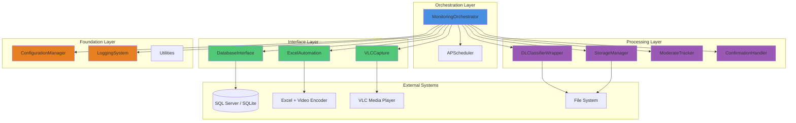
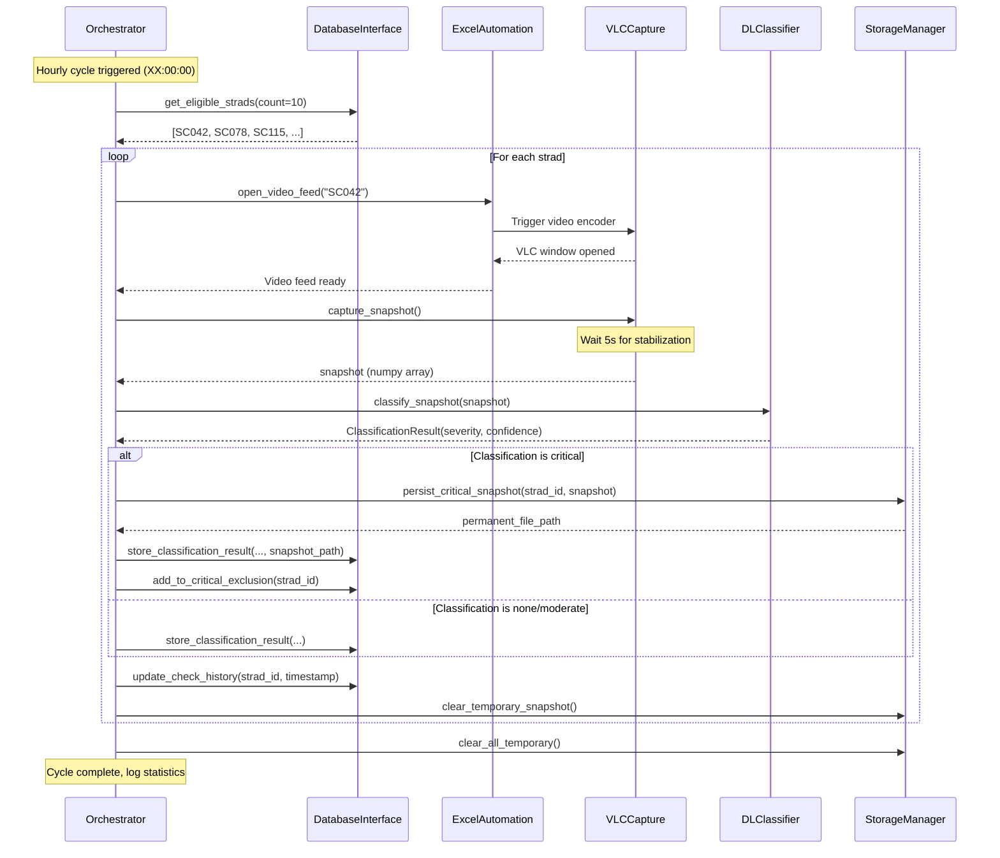

# Strad Carrier Monitoring Automation - Architecture Document

## Table of Contents

1. [Overview](#overview)
2. [System Architecture](#system-architecture)
3. [Component Breakdown](#component-breakdown)
4. [Data Flow](#data-flow)
5. [Database Schema](#database-schema)
6. [File Structure](#file-structure)
7. [Integration Points](#integration-points)
8. [Configuration Architecture](#configuration-architecture)
9. [Logging and Monitoring](#logging-and-monitoring)
10. [Error Handling Strategy](#error-handling-strategy)
11. [Current Limitations](#current-limitations)
12. [Future Enhancements](#future-enhancements)
13. [Demo vs Production](#demo-vs-production)

---

## Overview

### Purpose

The Strad Carrier Monitoring Automation system automates camera alignment monitoring for Strad Carrier vehicles (SC001-SC135). It integrates:
- **SQL Server / SQLite databases** for data persistence
- **Excel COM automation** for video encoder control
- **VLC media player** for snapshot capture
- **PyTorch deep learning models** for misalignment classification
- **APScheduler** for hourly cycle orchestration

### Key Design Goals

1. **Automation:** Eliminate manual monitoring intervention
2. **Integration:** Seamless connection between disparate systems (Excel, VLC, database, ML)
3. **Reliability:** Graceful error handling, retry logic, resource cleanup
4. **Efficiency:** Complete 10-unit cycles within 50 minutes
5. **Maintainability:** Clear code structure, comprehensive logging, externalized configuration


### Architecture Style

**Layered Architecture:**
```
┌─────────────────────────────────────────┐
│     ORCHESTRATION LAYER                 │  ← Coordinates workflow
│  (MonitoringOrchestrator, Scheduler)    │
└─────────────────┬───────────────────────┘
                  │
┌─────────────────▼───────────────────────┐
│        INTERFACE LAYER                  │  ← External system integration
│  (DatabaseInterface, ExcelAutomation,   │
│   VLCCapture)                           │
└─────────────────┬───────────────────────┘
                  │
┌─────────────────▼───────────────────────┐
│       PROCESSING LAYER                  │  ← Data transformation
│  (DLClassifierWrapper, StorageManager,  │
│   ModerateTracker, ConfirmationHandler) │
└─────────────────┬───────────────────────┘
                  │
┌─────────────────▼───────────────────────┐
│       FOUNDATION LAYER                  │  ← Core utilities
│  (ConfigurationManager, LoggingSystem,  │
│   RetryDecorator, Exceptions, Timing)   │
└─────────────────────────────────────────┘
```

### Technology Stack

| Layer | Component | Technology | Purpose |
|-------|-----------|------------|---------|
| **Language** | Core | Python 3.10+ | ML integration, library support |
| **Scheduling** | Orchestrator | APScheduler | Hourly cron triggers |
| **Database** | Primary | SQL Server 2016+ | Production data persistence |
| **Database** | Fallback | SQLite 3 | Local testing without SQL Server |
| **Excel** | Automation | pywin32 (COM) | Video encoder control |
| **Window** | Capture | pyautogui + win32gui | VLC screenshot capture |
| **ML** | Classification | PyTorch 2.0+ | LiteFlowNet2/SpyNet models |
| **Config** | Management | JSON | Human-readable configuration |
| **Logging** | System | Python logging | Daily rotation, multiple handlers |

---

## System Architecture

### High-Level Architecture Diagram




### Sequence Diagram: Single Strad Processing



---

## Component Breakdown

### 1. Monitoring Orchestrator

**File:** `src/strad_monitoring/orchestration/orchestrator.py`

**Responsibility:** Coordinates all components and schedules hourly monitoring cycles

**Key Methods:**
```python
class MonitoringOrchestrator:
    def __init__(self, config: SystemConfig)
        # Initialize all components
        
    def start(self) -> None
        # Start APScheduler (blocking)
        
    def run_cycle(self) -> Dict
        # Execute one monitoring cycle (10 strads)
        
    def process_single_strad(self, strad_id: str) -> StradResult
        # Process: capture → classify → store
        
    def stop(self) -> None
        # Graceful shutdown with cleanup
```

**Dependencies:**
- APScheduler (CronTrigger for hourly execution)
- All interface layer components
- All processing layer components
- Configuration and logging systems

**State Management:**
- `_is_running`: Orchestrator operational status
- `_shutdown_requested`: Graceful shutdown flag
- `_cycle_in_progress`: Current cycle status
- `_current_strad_id`: Currently processing strad
- `_cycle_count`: Total cycles executed
- `_total_strads_processed/failed`: Cumulative statistics

**Error Handling:**
- Component failures logged and skipped
- Cycle continues with remaining strads
- Graceful shutdown waits up to 5 minutes for completion


### 2. Database Interface

**File:** `src/strad_monitoring/database/database_interface.py`

**Responsibility:** Manage all SQL Server/SQLite interactions

**Key Methods:**
```python
class DatabaseInterface:
    def get_eligible_strads(self, count: int = 10) -> List[str]
        # PRIMARY: SQL Server stored procedure
        # FALLBACK: SQLite query or alternative data source
        
    def store_classification_result(self, strad_id, classification, confidence, snapshot_path)
        # Insert into classification_results table
        
    def update_check_history(self, strad_id, timestamp)
        # Update last_check_timestamp
        
    def add_to_critical_exclusion(self, strad_id)
        # Insert into critical_strad_exclusions
        
    def remove_from_critical_exclusion(self, strad_id)
        # Delete from critical_strad_exclusions
        
    def cleanup_old_history(self, days: int = 7) -> int
        # Remove records older than retention period
        
    def health_check(self) -> bool
        # Verify database connectivity
```

**Fallback Mechanism:**

```python
def get_eligible_strads(self, count: int = 10) -> List[str]:
    try:
        # ========================================
        # PRIMARY PATH: Production SQL Server
        # ========================================
        return self._query_production_server(count)
    except ConnectionError:
        # ========================================
        # FALLBACK PATH: Local Testing Mode
        # ========================================
        if self.fallback_data_source == "sqlite":
            return self._load_strads_from_sqlite(count)
        elif self.fallback_data_source == "kitti":
            return self._load_strads_from_kitti(count)
        elif self.fallback_data_source == "local_folder":
            return self._load_strads_from_local_folder(count)
        else:
            return self._generate_random_test_strads(count)
```

**Connection Management:**
- **Primary:** pyodbc with connection pooling (min=2, max=10)
- **Fallback:** sqlite3 with file-based database
- **Retry:** Exponential backoff (1s, 2s, 4s) for transient errors
- **Timeout:** 30 seconds for queries


### 3. Excel Automation

**File:** `src/strad_monitoring/excel_automation/excel_automation.py`

**Responsibility:** Control Excel workbook with video encoder ActiveX control

**Key Methods:**
```python
class ExcelAutomation:
    def open_video_feed(self, strad_id: str) -> bool
        # 1. Open Excel workbook
        # 2. Locate "spreader video encoder" control
        # 3. Input strad ID (SCXXX format)
        # 4. Activate control to trigger VLC
        # 5. Wait for VLC window (30s timeout)
        # Returns: True if successful, False if timeout
        
    def close_video_feed(self)
        # Close current video feed
        
    def cleanup(self)
        # Release COM objects, prevent Excel process leaks
```

**COM Automation:**
```python
import win32com.client
import pythoncom

# Initialize COM
pythoncom.CoInitialize()
excel = win32com.client.Dispatch("Excel.Application")
excel.Visible = False  # Hidden to avoid UI flickering

# Open workbook
workbook = excel.Workbooks.Open(excel_file_path)
worksheet = workbook.Sheets(1)

# Locate video encoder control
control = worksheet.OLEObjects("spreader video encoder")
control.Object.Value = "SC042"
control.Object.Click()

# Wait for VLC window
import win32gui
hwnd = win32gui.FindWindow("VLC media player", None)
```

**Error Handling:**
- VLC timeout after 30 seconds
- COM object cleanup in finally blocks
- Excel application lifecycle management


### 4. VLC Capture

**File:** `src/strad_monitoring/vlc_capture/vlc_capture.py`

**Responsibility:** Capture snapshots from VLC media player window

**Key Methods:**
```python
class VLCCapture:
    def capture_snapshot(self) -> np.ndarray
        # 1. Wait 5s for feed stabilization
        # 2. Locate VLC window
        # 3. Bring window to foreground
        # 4. Capture screenshot
        # 5. Validate dimensions (≥640x480)
        # Returns: RGB numpy array (H, W, 3)
        
    def validate_snapshot(self, snapshot: np.ndarray) -> bool
        # Verify minimum dimensions
```

**Window Automation:**
```python
import win32gui
import pyautogui

# Locate VLC window
hwnd = win32gui.FindWindow("VLC media player", None)

# Bring to foreground
win32gui.SetForegroundWindow(hwnd)

# Get window position
x, y, right, bottom = win32gui.GetWindowRect(hwnd)

# Capture screenshot
snapshot = pyautogui.screenshot(region=(x, y, right-x, bottom-y))

# Convert to numpy array (RGB)
snapshot_array = np.array(snapshot)
```

**Retry Logic:**
- 3 retry attempts on capture failure
- 2-second interval between retries
- Multi-monitor handling


### 5. DL Classifier Wrapper

**File:** `src/strad_monitoring/dl_classifier/classifier_wrapper.py`

**Responsibility:** Integrate existing PyTorch misalignment detection models

**Key Methods:**
```python
@dataclass
class ClassificationResult:
    severity: str  # 'none', 'moderate', 'critical'
    confidence: float  # 0.0 to 1.0
    processing_time_ms: float
    raw_output: Dict

class DLClassifierWrapper:
    def classify_snapshot(self, snapshot: np.ndarray) -> ClassificationResult
        # 1. Preprocess: resize to 640x640, normalize
        # 2. Run inference on GPU
        # 3. Map probability to severity
        # 4. Return classification result
```

**Model Integration:**
```python
from src.dl_misalignment.inference.inference_engine import InferenceEngine

# Load model checkpoint
engine = InferenceEngine(
    checkpoint_path=model_checkpoint_path,
    config=dl_model_config,
    device='cuda'
)

# Classify
detection = engine.infer_single_camera(
    camera_id='strad_camera',
    image=snapshot
)

# Map probability to severity
severity = map_severity(detection.probability)
# < 0.3: "none"
# 0.3-0.7: "moderate"
# ≥ 0.7: "critical"
```

**Performance:**
- **GPU (CUDA):** 5-15 seconds per snapshot
- **CPU:** 30-60 seconds per snapshot (not recommended)
- **Timeout:** 10 seconds (configurable)
- **Model caching:** Single load at startup, reused for all classifications


### 6. Storage Manager

**File:** `src/strad_monitoring/storage/storage_manager.py`

**Responsibility:** Manage temporary and permanent snapshot storage

**Key Methods:**
```python
class StorageManager:
    def store_temporary_snapshot(self, strad_id, snapshot) -> str
        # Save to temp_storage_path/{strad_id}_{uuid}.jpg
        
    def persist_critical_snapshot(self, strad_id, snapshot, timestamp) -> str
        # Save to permanent_storage_path/YYYY-MM-DD/{strad_id}_{timestamp}.jpg
        
    def clear_temporary_snapshot(self, temp_path)
        # Remove from temporary storage
        
    def clear_all_temporary(self)
        # Clear all temp snapshots (end of cycle)
        
    def cleanup_old_snapshots(self) -> int
        # Remove snapshots older than retention period (30 days)
        
    def check_available_space(self) -> float
        # Check available disk space in GB
```

**Directory Structure:**
```
C:\StradMonitoring\temp_snapshots\
├── SC042_uuid1234.jpg
├── SC078_uuid5678.jpg
└── ...

D:\StradMonitoring\critical_snapshots\
├── 2024-01-15\
│   ├── SC042_20240115_143029.jpg
│   └── SC078_20240115_145511.jpg
├── 2024-01-16\
│   └── SC123_20240116_090234.jpg
└── ...
```

**File Operations:**
- **JPEG quality:** 85 (balance between size and quality)
- **Atomic writes:** Save to .tmp, verify, rename
- **Verification:** PIL.Image.open() to ensure readability
- **Cleanup:** Daily job at midnight via APScheduler


### 7. Moderate Classification Tracker

**File:** `src/strad_monitoring/database/moderate_tracker.py`

**Responsibility:** Track consecutive moderate classifications and generate warnings

**Key Methods:**
```python
class ModerateClassificationTracker:
    def track_classification(self, strad_id, classification)
        # Update in-memory counter
        # Query database for recent classifications (24h window)
        # If 3 consecutive moderates within 24h, generate warning
        
    def get_consecutive_count(self, strad_id) -> int
        # Return consecutive moderate count
        
    def reset_tracker(self, strad_id)
        # Reset counter (when non-moderate classification occurs)
```

**Warning Logic:**
```
SC042: moderate (10:00) → count = 1
SC042: moderate (11:30) → count = 2
SC042: moderate (14:00) → count = 3 → WARNING GENERATED
SC042: none (16:00)     → count = 0 (reset)
```

**Integration:**
- Queries classification_results table for last 24 hours
- Maintains in-memory state for performance
- Does NOT exclude moderate strads from rotation (unlike critical)


### 8. Confirmation Handler

**File:** `src/strad_monitoring/orchestration/confirmation_handler.py`

**Responsibility:** Process adjustment confirmations to return critical strads to rotation

**Key Methods:**
```python
class ConfirmationHandler:
    def process_confirmation(
        self, 
        che_number, 
        technician_id, 
        confirmation_timestamp, 
        notes=None
    ) -> Dict
        # 1. Validate che_number in critical_strad_exclusions
        # 2. Record confirmation in adjustment_confirmations table
        # 3. Remove from critical_strad_exclusions
        # 4. Reset check_history timestamp
        # Returns: {'success': bool, 'message': str}
```

**Workflow:**
```
1. Critical classification → Strad added to exclusion list
2. Maintenance technician adjusts camera physically
3. Technician calls process_confirmation(che_number, technician_id, ...)
4. System records confirmation and removes from exclusion
5. Strad eligible for selection in next cycle
```

**Database Operations:**
```sql
-- Record confirmation
INSERT INTO adjustment_confirmations 
(strad_id, technician_id, confirmation_timestamp, notes)
VALUES ('SC042', 'TECH001', '2024-01-15 16:45:00', 'Adjusted bracket');

-- Remove from exclusion list
DELETE FROM critical_strad_exclusions WHERE strad_id = 'SC042';

-- Reset check history
UPDATE strad_action_check_by_id_and_timestamp
SET last_check_timestamp = DATEADD(HOUR, -2, GETDATE())
WHERE strad_id = 'SC042';
```

---

## Data Flow

### Complete Cycle Data Flow

```
START: XX:00:00 (Hourly trigger via APScheduler)
│
├─> [1] DatabaseInterface.get_eligible_strads(count=10)
│   │
│   ├─> PRIMARY: Query SQL Server stored procedure
│   │   │
│   │   └─> SELECT TOP 10 strad_id
│   │       FROM strad_action_check_by_id_and_timestamp
│   │       WHERE DATEDIFF(MINUTE, last_check_timestamp, GETDATE()) >= 60
│   │       AND strad_id NOT IN (SELECT strad_id FROM critical_strad_exclusions)
│   │       ORDER BY NEWID()
│   │
│   └─> FALLBACK: SQLite / KITTI / CSV / Random
│       │
│       └─> SELECT DISTINCT CHE FROM container_demo ORDER BY RANDOM() LIMIT 10
│
├─> [2] FOR EACH strad_id IN selected_strads:
│   │
│   ├─> [2a] ExcelAutomation.open_video_feed(strad_id)
│   │   │
│   │   ├─> Open Excel workbook via COM
│   │   ├─> Locate "spreader video encoder" control
│   │   ├─> Input strad_id (SCXXX format)
│   │   ├─> Activate control → Triggers VLC
│   │   └─> Poll for VLC window (30s timeout)
│   │
│   ├─> [2b] VLCCapture.capture_snapshot()
│   │   │
│   │   ├─> Sleep 5 seconds (feed stabilization)
│   │   ├─> Locate VLC window (win32gui.FindWindow)
│   │   ├─> Bring window to foreground
│   │   ├─> Capture screenshot (pyautogui.screenshot)
│   │   └─> Validate dimensions (≥640x480)
│   │
│   ├─> [2c] DLClassifierWrapper.classify_snapshot(snapshot)
│   │   │
│   │   ├─> Preprocess: Resize to 640x640, normalize
│   │   ├─> Run inference: InferenceEngine.infer_single_camera()
│   │   ├─> Map probability to severity:
│   │   │   - < 0.3: "none"
│   │   │   - 0.3-0.7: "moderate"
│   │   │   - ≥ 0.7: "critical"
│   │   └─> Return ClassificationResult(severity, confidence)
│   │
│   └─> [2d] Store results (conditional on severity)
│       │
│       ├─> IF severity == "critical":
│       │   │
│       │   ├─> StorageManager.persist_critical_snapshot(...)
│       │   │   │
│       │   │   └─> Save to permanent_storage_path/YYYY-MM-DD/SC042_timestamp.jpg
│       │   │
│       │   ├─> DatabaseInterface.store_classification_result(..., snapshot_path)
│       │   │   │
│       │   │   └─> INSERT INTO classification_results
│       │   │       (strad_id, classification, confidence, snapshot_path, created_at)
│       │   │
│       │   └─> DatabaseInterface.add_to_critical_exclusion(strad_id)
│       │       │
│       │       └─> INSERT INTO critical_strad_exclusions (strad_id, added_at)
│       │
│       └─> ELSE (none/moderate):
│           │
│           └─> DatabaseInterface.store_classification_result(..., snapshot_path=NULL)
│               │
│               └─> INSERT INTO classification_results
│                   (strad_id, classification, confidence, created_at)
│
├─> [3] DatabaseInterface.update_check_history(strad_id, timestamp)
│   │
│   └─> UPDATE strad_action_check_by_id_and_timestamp
│       SET last_check_timestamp = GETDATE()
│       WHERE strad_id = ?
│
├─> [4] StorageManager.clear_temporary_snapshot()
│   │
│   └─> DELETE temp_snapshots/{strad_id}_{uuid}.jpg
│
└─> [5] CYCLE END: StorageManager.clear_all_temporary()
    │
    ├─> DELETE all files in temp_snapshots/
    └─> Log cycle statistics (duration, processed, failed)
```

---

## Database Schema

### Current State (SQL Server / SQLite)

#### Table: strad_action_check_by_id_and_timestamp

**Purpose:** Track when each strad was last checked (cooldown enforcement)

```sql
CREATE TABLE strad_action_check_by_id_and_timestamp (
    strad_id VARCHAR(10) PRIMARY KEY,  -- Format: SCXXX (SC001-SC135)
    last_check_timestamp DATETIME2 NOT NULL,
    INDEX idx_last_check (last_check_timestamp)
);
```

**Sample Data:**
```
strad_id | last_check_timestamp
---------|---------------------
SC001    | 2024-01-15 09:15:00
SC042    | 2024-01-15 10:30:00
SC078    | 2024-01-15 10:32:00
```

#### Table: classification_results

**Purpose:** Store classification outcomes with timestamps

```sql
CREATE TABLE classification_results (
    id INT IDENTITY(1,1) PRIMARY KEY,
    strad_id VARCHAR(10) NOT NULL,
    classification VARCHAR(20) NOT NULL,  -- 'none', 'moderate', 'critical'
    confidence FLOAT NOT NULL,            -- 0.0 to 1.0
    snapshot_path VARCHAR(500),           -- NULL for none/moderate
    created_at DATETIME2 DEFAULT GETDATE(),
    INDEX idx_strad_created (strad_id, created_at)
);
```

**Sample Data:**
```
id | strad_id | classification | confidence | snapshot_path                                        | created_at
---|----------|----------------|------------|-----------------------------------------------------|-------------------
1  | SC042    | critical       | 0.87       | D:\critical_snapshots\2024-01-15\SC042_20240115...  | 2024-01-15 14:30:29
2  | SC078    | moderate       | 0.52       | NULL                                                | 2024-01-15 14:32:15
3  | SC115    | none           | 0.12       | NULL                                                | 2024-01-15 14:34:02
```


#### Table: critical_strad_exclusions

**Purpose:** Track strads excluded from rotation due to critical misalignment

```sql
CREATE TABLE critical_strad_exclusions (
    strad_id VARCHAR(10) PRIMARY KEY,
    added_at DATETIME2 DEFAULT GETDATE(),
    adjustment_confirmed_at DATETIME2 NULL,
    technician_id VARCHAR(50) NULL
);
```

**Sample Data:**
```
strad_id | added_at            | adjustment_confirmed_at | technician_id
---------|---------------------|------------------------|---------------
SC042    | 2024-01-15 14:30:29 | NULL                   | NULL
SC123    | 2024-01-14 11:22:15 | 2024-01-15 09:00:00    | TECH001
```

**Note:** SC042 is currently excluded, SC123 was excluded but confirmed

#### Table: adjustment_confirmations

**Purpose:** Record when critical strads have been adjusted and confirmed

```sql
CREATE TABLE adjustment_confirmations (
    id INT IDENTITY(1,1) PRIMARY KEY,
    strad_id VARCHAR(10) NOT NULL,
    technician_id VARCHAR(50) NOT NULL,
    confirmation_timestamp DATETIME2 DEFAULT GETDATE(),
    notes VARCHAR(500) NULL,
    INDEX idx_strad_timestamp (strad_id, confirmation_timestamp)
);
```

**Sample Data:**
```
id | strad_id | technician_id | confirmation_timestamp  | notes
---|----------|---------------|------------------------|--------------------------------
1  | SC123    | TECH001       | 2024-01-15 09:00:00    | Adjusted camera mounting bracket
2  | SC027    | TECH002       | 2024-01-15 11:30:00    | Replaced camera, verified alignment
```


### SQLite Fallback Schema (tests/test.db)

#### Table: container_demo

**Purpose:** Test data for local development (mimics production strad data)

```sql
CREATE TABLE container_demo (
    CONT_ID INTEGER,
    TIME_STAMP TEXT NOT NULL,
    CONT_ACTION TEXT NOT NULL CHECK (CONT_ACTION IN ('PICKED', 'GROUNDED')),
    CONT_NAME TEXT NOT NULL,
    LocalTimeStamp TEXT NOT NULL,
    CHE TEXT NOT NULL,  -- Strad ID (SC001-SC135)
    -- ... additional fields ...
    PRIMARY KEY (CONT_ID, CHE)
);
```

**Sample Data (20 records):**
```
CONT_ID | TIME_STAMP          | CONT_ACTION | CHE   | LocalTimeStamp
--------|---------------------|-------------|-------|-------------------
1001    | 2026-06-25 10:01:00 | PICKED      | SC001 | 2026-06-25 10:01:00
1002    | 2026-06-25 10:02:00 | GROUNDED    | SC006 | 2026-06-25 10:02:00
1003    | 2026-06-25 10:03:00 | PICKED      | SC012 | 2026-06-25 10:03:00
...
```

**CHE Values Available:**
SC001, SC006, SC012, SC027, SC028, SC031, SC039, SC049, SC052, SC062, SC063, SC083, SC085, SC095, SC110, SC111, SC115, SC127

**Query for Fallback:**
```sql
SELECT DISTINCT CHE 
FROM container_demo 
ORDER BY RANDOM() 
LIMIT 10;
```

---

## File Structure

### Project Organization

```
exp_2/
├── .kiro/
│   └── specs/
│       └── strad-carrier-monitoring-automation/
│           ├── .config.kiro
│           ├── requirements.md
│           ├── design.md
│           ├── tasks.md
│           └── LOCAL_TESTING_GUIDE.md
│
├── src/
│   └── strad_monitoring/
│       ├── __init__.py
│       ├── main.py                              # Entry point
│       │
│       ├── config/
│       │   ├── __init__.py
│       │   ├── system_config.py                 # ConfigurationManager
│       │   └── calibration.py
│       │
│       ├── database/
│       │   ├── __init__.py
│       │   ├── database_interface.py            # SQL Server / SQLite
│       │   └── moderate_tracker.py              # Moderate classification tracking
│       │
│       ├── excel_automation/
│       │   ├── __init__.py
│       │   └── excel_automation.py              # COM automation
│       │
│       ├── vlc_capture/
│       │   ├── __init__.py
│       │   └── vlc_capture.py                   # Window capture
│       │
│       ├── dl_classifier/
│       │   ├── __init__.py
│       │   └── classifier_wrapper.py            # PyTorch model wrapper
│       │
│       ├── storage/
│       │   ├── __init__.py
│       │   └── storage_manager.py               # Snapshot storage
│       │
│       ├── orchestration/
│       │   ├── __init__.py
│       │   ├── orchestrator.py                  # Main orchestrator
│       │   └── confirmation_handler.py          # Adjustment confirmations
│       │
│       ├── logging/
│       │   ├── __init__.py
│       │   └── logging_system.py                # Logging configuration
│       │
│       └── utils/
│           ├── __init__.py
│           ├── exceptions.py                    # Custom exceptions
│           ├── retry.py                         # Retry decorator
│           ├── timing.py                        # Timing utilities
│           └── alerting.py                      # Alert notifications
│
├── tests/
│   ├── test.db                                  # SQLite test database (20 records)
│   ├── properties/                              # Property-based tests
│   ├── integration/                             # Integration tests
│   └── unit/                                    # Unit tests
│
├── system_config.json                           # Main configuration file
├── requirements.txt                             # Python dependencies
├── DEPLOYMENT.md                                # Deployment guide
├── SQLITE_FALLBACK_INTEGRATION.md               # SQLite fallback docs
├── USER_GUIDE.md                                # User guide (this document)
└── ARCHITECTURE.md                              # Architecture document
```


### Key Files

| File | Purpose | Status |
|------|---------|--------|
| `src/strad_monitoring/main.py` | Application entry point | ✅ Complete |
| `src/strad_monitoring/orchestration/orchestrator.py` | Main coordination logic | ✅ Complete |
| `src/strad_monitoring/database/database_interface.py` | Database operations | ✅ Complete |
| `src/strad_monitoring/excel_automation/excel_automation.py` | Excel COM automation | ✅ Complete |
| `src/strad_monitoring/vlc_capture/vlc_capture.py` | VLC screenshot capture | ✅ Complete |
| `src/strad_monitoring/dl_classifier/classifier_wrapper.py` | DL classification | ✅ Complete |
| `src/strad_monitoring/storage/storage_manager.py` | Snapshot storage | ✅ Complete |
| `system_config.json` | System configuration | ✅ Complete |
| `tests/test.db` | SQLite test database | ✅ Complete (20 records) |
| `DEPLOYMENT.md` | Deployment guide | ✅ Complete |
| `USER_GUIDE.md` | User documentation | ✅ Complete |
| `ARCHITECTURE.md` | Architecture documentation | ✅ Complete |

---

## Integration Points

### 1. SQL Server Integration

**Connection:** ODBC Driver 17 for SQL Server

**Authentication:** Windows authentication (Trusted_Connection=yes) or SQL Server authentication

**Operations:**
- **Read:** Stored procedure `strad_action_check_by_id_and_timestamp` for eligible strads
- **Write:** INSERT classification results, UPDATE check history, INSERT/DELETE exclusions
- **Pooling:** Min=2, Max=10 connections
- **Timeout:** 30 seconds per query
- **Retry:** Exponential backoff (1s, 2s, 4s)

**Fallback:** SQLite (`tests/test.db`) when SQL Server unavailable

### 2. Excel COM Integration

**Technology:** pywin32 (win32com.client)

**Requirements:**
- Microsoft Excel 2016+ installed
- Excel workbook with "spreader video encoder" ActiveX control
- Windows operating system (COM automation is Windows-only)

**Operations:**
- **Launch:** `Dispatch("Excel.Application")`
- **Control:** Locate OLEObject by name, set Value, trigger Click
- **Cleanup:** Release COM objects in finally blocks to prevent leaks

**Limitations:**
- Must run on Windows
- Requires Excel installed and licensed
- Single-threaded (COM is not thread-safe without additional setup)


### 3. VLC Media Player Integration

**Technology:** Window automation (win32gui + pyautogui)

**Requirements:**
- VLC Media Player 3.0+ installed
- Window title must be exactly "VLC media player"
- Primary display (multi-monitor scenarios require window on primary display)

**Operations:**
- **Locate:** `win32gui.FindWindow("VLC media player", None)`
- **Foreground:** `win32gui.SetForegroundWindow(hwnd)`
- **Capture:** `pyautogui.screenshot(region=(x, y, w, h))`
- **Validation:** Verify dimensions ≥ 640x480

**Limitations:**
- Requires VLC window visible (not minimized)
- Window title must match exactly
- Screenshot quality depends on video feed quality

### 4. PyTorch Model Integration

**Technology:** PyTorch 2.0+ with CUDA

**Models:** LiteFlowNet2 or SpyNet (configurable)

**Requirements:**
- NVIDIA GPU with CUDA 11.7+ (GPU highly recommended)
- Model checkpoint file (.pth)
- VRAM: 4GB+ recommended

**Operations:**
- **Load:** InferenceEngine with checkpoint path
- **Preprocess:** Resize to 640x640, normalize
- **Infer:** `infer_single_camera(camera_id, image)`
- **Postprocess:** Map probability to severity level

**Performance:**
- **GPU:** 5-15 seconds per snapshot
- **CPU:** 30-60 seconds per snapshot (fallback, not recommended)

---

## Configuration Architecture

### Configuration File: system_config.json

**Location:** Root directory (or specify via `--config` flag)

**Format:** JSON (human-readable, supports comments as unused keys)

**Structure:**

```json
{
  "_comment_*": "Comments (ignored by parser)",
  
  "database_connection_string": "ODBC connection string",
  
  "excel_file_path": "Path to Excel workbook",
  "model_checkpoint_path": "Path to PyTorch model",
  "temp_snapshot_path": "Temporary storage directory",
  "permanent_snapshot_path": "Critical snapshot storage",
  "log_file_path": "Log file directory",
  
  "cycle_schedule_cron": "Cron expression (0 * * * *)",
  "strad_selection_count": 10,
  "cooldown_hours": 1,
  "classification_timeout_seconds": 10,
  
  "snapshot_min_width": 640,
  "snapshot_min_height": 480,
  "snapshot_retention_days": 30,
  "log_retention_days": 14,
  
  "enable_local_testing_mode": true/false,
  "use_sqlite_fallback": true/false,
  "sqlite_db_path": "tests/test.db",
  "fallback_data_source": "sqlite|kitti|local_folder|random",
  "fallback_data_path": "Path to fallback data",
  
  "dl_model_config": {
    "flow_network": "liteflownet2|spynet",
    "target_resolution": [640, 640],
    "confidence_threshold": 0.5,
    "enable_uncertainty": false
  }
}
```


### Configuration Validation

**Performed at startup** before any component initialization:

```python
errors = ConfigurationManager.validate_config(config)

# Checks:
# - All required fields present
# - File paths exist and accessible
# - Database connection string valid format
# - Numeric values within reasonable ranges
# - Cron expression valid syntax
```

**Validation Errors:**
- Missing required fields → Refuse to start
- Invalid file paths → Refuse to start (unless fallback enabled)
- Invalid numeric ranges → Refuse to start
- Database unreachable + fallback disabled → Refuse to start

### Environment Variables (Optional)

**Syntax:** `${ENV_VAR}` in configuration values

**Example:**
```json
{
  "database_connection_string": "DRIVER={...};SERVER=${DB_SERVER};DATABASE=${DB_NAME};...",
  "permanent_snapshot_path": "${SNAPSHOT_ROOT}\\critical_snapshots"
}
```

**Substitution at load time:**
```python
import os
value = config_value.replace("${DB_SERVER}", os.getenv("DB_SERVER", "default-server"))
```

---

## Logging and Monitoring

### Logging System Architecture

**Implementation:** Python `logging` module with handlers

**Configuration:**
- **Log level:** INFO (default), DEBUG (development), ERROR (production alerts)
- **Rotation:** Daily rotation at midnight
- **Retention:** 14 days (configurable)
- **Format:** `YYYY-MM-DD HH:MM:SS,mmm [LEVEL] [Component] Message`

**Handlers:**
1. **RotatingFileHandler:** Daily log files with automatic rotation
2. **StreamHandler (console):** Optional console output (enabled in main.py)
3. **QueueHandler:** Asynchronous logging to prevent I/O blocking

**Log File Naming:**
```
monitoring_log_2024-01-15.txt
monitoring_log_2024-01-16.txt
monitoring_log_2024-01-17.txt
```

### Log Levels by Component

| Component | INFO | WARNING | ERROR | CRITICAL |
|-----------|------|---------|-------|----------|
| Orchestrator | Cycle start/end, statistics | Cycle > 50min | Component failure | Unrecoverable error |
| DatabaseInterface | Query results, connections | Fallback activated | Query timeout | Connection lost |
| ExcelAutomation | Video feed opened | VLC slow start | VLC timeout | Excel crash |
| VLCCapture | Snapshot captured | Retry attempt | Capture failed | Window unavailable |
| DLClassifier | Classification result | Low confidence | Classification timeout | Model load failure |
| StorageManager | Snapshot saved | Low disk space | Save failed | Disk full |


### Key Log Messages

**System Initialization:**
```
[INFO] [Main] STRAD CARRIER MONITORING AUTOMATION - INITIALIZATION
[INFO] [Main] Configuration file: system_config.json
[INFO] [Main] ✓ Configuration validated successfully
[INFO] [Main] ✓ Database connectivity verified
[INFO] [MonitoringOrchestrator] ✓ Orchestrator initialized successfully
```

**Cycle Execution:**
```
[INFO] [MonitoringOrchestrator] MONITORING CYCLE #5 STARTED
[INFO] [MonitoringOrchestrator] Cycle start time: 2024-01-15 14:00:00
[INFO] [DatabaseInterface] Retrieved 10 eligible strads: [SC042, SC078, ...]
[INFO] [MonitoringOrchestrator] Processing strad 1/10: SC042
[INFO] [DLClassifier] Classification: critical, confidence: 0.87
[INFO] [StorageManager] Critical snapshot saved: D:\...\SC042_20240115_143029.jpg
[INFO] [MonitoringOrchestrator] ✓ SC042 processed successfully
[INFO] [MonitoringOrchestrator] MONITORING CYCLE #5 COMPLETED
[INFO] [MonitoringOrchestrator] Duration: 1935.2 seconds (32.3 minutes)
[INFO] [MonitoringOrchestrator] Strads processed: 9, Strads failed: 1
```

**Fallback Activation:**
```
[WARNING] [DatabaseInterface] SQL Server unavailable: [Error details]
[WARNING] [DatabaseInterface] Using local testing fallback: sqlite
[INFO] [DatabaseInterface] Loading strads from SQLite database: tests/test.db
[INFO] [DatabaseInterface] Selected 10 strads from SQLite: ['SC001', 'SC006', ...]
```

**Error Scenarios:**
```
[ERROR] [ExcelAutomation] Failed to open video feed for SC042: VLC timeout after 30s
[ERROR] [VLCCapture] Snapshot capture failed after 3 retries: Window not found
[CRITICAL] [DatabaseInterface] SQL Server connection lost - cannot store results
```

---

## Error Handling Strategy

### Error Hierarchy

**Custom Exceptions:**
```python
# Base exception
class MonitoringSystemError(Exception):
    """Base exception for monitoring system"""

# Specialized exceptions
class ConfigurationError(MonitoringSystemError):
    """Configuration loading/validation errors"""

class DatabaseError(MonitoringSystemError):
    """Database connectivity and query errors"""

class ExcelAutomationError(MonitoringSystemError):
    """Excel COM automation errors"""

class VLCCaptureError(MonitoringSystemError):
    """VLC window and snapshot capture errors"""

class ClassificationError(MonitoringSystemError):
    """DL model inference errors"""

class StorageError(MonitoringSystemError):
    """Snapshot storage errors"""

class CriticalError(MonitoringSystemError):
    """Unrecoverable errors requiring immediate attention"""
```

### Retry Strategy

**Retry Decorator:**
```python
@retry(max_attempts=3, backoff=[1, 2, 4], exceptions=(DatabaseError, VLCCaptureError))
def capture_snapshot():
    # Attempt 1: Immediate
    # Attempt 2: After 1 second
    # Attempt 3: After 2 seconds
    # Attempt 4: After 4 seconds
    # If all fail: Raise original exception
```

**Retry Policy by Component:**

| Component | Max Attempts | Backoff | Exceptions to Retry |
|-----------|--------------|---------|---------------------|
| DatabaseInterface | 3 | 1s, 2s, 4s | Connection errors, timeouts |
| VLCCapture | 3 | 2s, 2s, 2s | Window not found, capture failed |
| ExcelAutomation | 2 | 5s, 5s | VLC timeout, COM errors |
| DLClassifier | 1 | N/A | None (timeout instead) |


### Error Recovery Workflow

```
┌─────────────────────────────────────┐
│  Component Operation Attempted      │
└─────────────┬───────────────────────┘
              │
              ▼
┌─────────────────────────────────────┐
│  Operation Failed (Exception)       │
└─────────────┬───────────────────────┘
              │
              ▼
     ┌────────────────┐
     │ Is Retryable?  │
     └───┬────────┬───┘
         │        │
      YES│        │NO
         │        │
         ▼        ▼
┌─────────────┐  ┌─────────────────┐
│ Retry with  │  │ Log Error       │
│ Backoff     │  │ Skip Strad      │
│ (3 attempts)│  │ Continue Cycle  │
└─────┬───────┘  └─────────────────┘
      │
      ▼
┌─────────────────────────────────────┐
│  All Retries Exhausted?             │
└───┬─────────────────────────────┬───┘
    │                             │
 YES│                             │NO (Success)
    │                             │
    ▼                             ▼
┌─────────────────┐        ┌─────────────────┐
│ Log Error       │        │ Continue        │
│ Skip Strad      │        │ Processing      │
│ Continue Cycle  │        └─────────────────┘
└─────────────────┘
```

### Critical Error Handling

**Critical errors** require immediate attention and may pause the system:

1. **Database connection lost:** Cannot store results → Pause cycles, send alert
2. **DL model unavailable:** Cannot classify → Pause cycles, send alert
3. **Disk full:** Cannot save snapshots → Send alert, attempt cleanup
4. **Excel/VLC permanently unavailable:** Cannot capture snapshots → Send alert

**Alert Channels (Future Enhancement):**
- Email notifications to operations team
- SMS alerts for critical failures
- Dashboard status indicators
- Log aggregation system integration

---

## Current Limitations

### Technical Limitations

1. **Windows-Only:**
   - Excel COM automation requires Windows OS
   - VLC window capture uses Windows APIs
   - No Linux/Mac support without significant rearchitecture

2. **Single-Threaded Processing:**
   - Strads processed serially (one at a time)
   - Cannot parallelize due to Excel COM limitations
   - Cycle time scales linearly with strad count

3. **VLC Dependency:**
   - Requires VLC media player for snapshot capture
   - Cannot use alternative video players without code changes
   - Window must be visible (not minimized)

4. **GPU Required for Performance:**
   - CPU inference is 3-5x slower than GPU
   - NVIDIA GPU with CUDA required for reasonable performance
   - No AMD GPU support (PyTorch CUDA limitation)

5. **No Web Interface:**
   - Command-line and log-based monitoring only
   - No real-time dashboard
   - No web-based confirmation handler UI

### Functional Limitations

1. **Manual Confirmation Required:**
   - Critical strads require manual technician confirmation
   - No automated re-verification of adjusted cameras
   - Technician must submit confirmation through code/API

2. **Limited Alert System:**
   - Logging only (no email/SMS alerts)
   - No integration with operations dashboard
   - Requires manual log monitoring

3. **No Historical Analysis:**
   - Basic database storage only
   - No trend analysis or reporting
   - No prediction of future misalignments


4. **Minimal Testing:**
   - Unit tests exist but coverage incomplete
   - Property-based tests defined but not all implemented
   - Integration tests minimal
   - No stress testing or long-term reliability validation

5. **Demo-Level Stability:**
   - Core functionality works for demonstration
   - Not validated for 24/7 production operation
   - No disaster recovery procedures
   - No high-availability configuration

### Known Issues

1. **Excel COM Leaks:**
   - COM objects may leak if cleanup fails
   - Requires periodic system restart for long-term operation
   - Mitigated by try-finally blocks but not eliminated

2. **VLC Window Detection:**
   - Sensitive to window title changes
   - Multi-monitor scenarios may fail
   - Window must be on primary display

3. **Snapshot Quality:**
   - Depends on video feed quality
   - No validation of image content (only dimensions)
   - Poor video quality may affect classification accuracy

4. **Fallback Data Realism:**
   - SQLite test data has only 20 records
   - Limited variation in test scenarios
   - Random generation doesn't reflect real-world patterns

---

## Future Enhancements

### For Production Readiness (Post-Management Approval)

1. **Alert System Integration:**
   - Email notifications for critical failures
   - SMS alerts for urgent issues
   - Integration with operations dashboard
   - Slack/Teams channel notifications

2. **Web Dashboard:**
   - Real-time monitoring of cycle progress
   - Strad status overview (last checked, classification history)
   - Critical strads list with confirmation interface
   - Historical analysis and trend charts
   - Web-based confirmation handler for technicians

3. **Enhanced Testing:**
   - Complete unit test coverage (>90%)
   - Comprehensive integration tests
   - Stress testing (concurrent operations, long-term stability)
   - Load testing (cycle time under various conditions)
   - Chaos engineering (failure injection)

4. **Performance Optimization:**
   - Parallel processing (multiple strads concurrently)
   - GPU batch inference (process multiple snapshots together)
   - Database query optimization
   - Caching frequently accessed data

5. **Reliability Improvements:**
   - Database connection pooling with health checks
   - Automatic reconnection on transient failures
   - Circuit breaker pattern for external services
   - Heartbeat monitoring
   - Automatic restart on critical failures


6. **Model Improvements:**
   - Retrain with full production dataset
   - Active learning (human feedback loop)
   - Model version management
   - A/B testing different model architectures
   - Uncertainty quantification

7. **Historical Analysis:**
   - Trend detection (strads deteriorating over time)
   - Predictive maintenance (forecast future misalignments)
   - Root cause analysis (correlate with operations data)
   - Reporting dashboard (weekly/monthly summaries)

8. **Deployment Improvements:**
   - Docker containerization
   - Kubernetes orchestration
   - Blue-green deployment
   - Automated rollback on failures
   - Configuration management (secrets, environment-specific configs)

9. **Security Enhancements:**
   - Encrypted database credentials
   - HTTPS for API endpoints (if web interface added)
   - Role-based access control
   - Audit logging for all operations
   - Compliance with security policies

10. **Operational Tools:**
    - CLI for common operations (list strads, force cycle, confirm adjustments)
    - Health check endpoint for monitoring systems
    - Metrics export (Prometheus, Grafana)
    - Backup and restore procedures
    - Disaster recovery plan

---

## Demo vs Production

### Demo Configuration (Current State)

**Status:** ✅ DEMO PRESENTABLE / DEPLOYMENT DEMO READY

**What Works:**
- ✅ Complete end-to-end workflow (database → Excel → VLC → classification → storage)
- ✅ All 8 components integrated and functional
- ✅ SQLite fallback with 20 realistic test records
- ✅ Error handling and recovery
- ✅ Graceful shutdown with resource cleanup
- ✅ Comprehensive logging with rotation
- ✅ Configuration management
- ✅ Property-based test framework (34 properties defined)
- ✅ Unit and integration test structure

**Configuration:**
```json
{
  "enable_local_testing_mode": true,
  "use_sqlite_fallback": true,
  "sqlite_db_path": "tests/test.db",
  "fallback_data_source": "sqlite",
  "cycle_schedule_cron": "0 * * * *",
  "strad_selection_count": 10
}
```

**Best For:**
- Stakeholder demonstrations
- Proof of concept validation
- Developer testing and debugging
- Management approval presentation
- Feature development and iteration


### Production Configuration (Post-Approval)

**Status:** ⏳ PENDING MANAGEMENT APPROVAL

**Requirements:**
- ⏳ SQL Server production database deployed
- ⏳ Excel video encoder infrastructure integrated
- ⏳ PyTorch model trained on full dataset
- ⏳ Windows service installation
- ⏳ Alert system configured
- ⏳ Load testing completed
- ⏳ Security audit passed
- ⏳ Disaster recovery plan documented

**Configuration:**
```json
{
  "enable_local_testing_mode": false,
  "use_sqlite_fallback": false,
  "database_connection_string": "DRIVER={...};SERVER=prod-server;DATABASE=StradMonitoring;Trusted_Connection=yes",
  "cycle_schedule_cron": "0 * * * *",
  "strad_selection_count": 10,
  "snapshot_retention_days": 90,
  "log_retention_days": 30
}
```

**Best For:**
- 24/7 automated monitoring
- Production fleet monitoring (SC001-SC135)
- Critical strad management
- Long-term reliability
- Operational efficiency

### Differences Summary

| Aspect | Demo | Production |
|--------|------|------------|
| **Database** | SQLite (20 test records) | SQL Server (135 real strads) |
| **Video Encoder** | Mocked / Test data | Production Excel automation |
| **Model** | Pre-trained sample model | Full production-trained model |
| **Deployment** | Manual execution | Windows service (24/7) |
| **Error Handling** | Log only | Log + Email/SMS alerts |
| **Testing** | Basic validation | Full test suite + stress tests |
| **Monitoring** | Logs only | Logs + Dashboard + Metrics |
| **Approval Status** | Ready | Pending management sign-off |

---

## Additional Resources

### Documentation

- **USER_GUIDE.md** - Comprehensive user guide for demo and testing
- **DEPLOYMENT.md** - Detailed installation and deployment procedures
- **SQLITE_FALLBACK_INTEGRATION.md** - SQLite fallback mechanism documentation
- **LOCAL_TESTING_GUIDE.md** - All fallback options and local testing guide
- **Requirements Document** - `.kiro/specs/strad-carrier-monitoring-automation/requirements.md`
- **Design Document** - `.kiro/specs/strad-carrier-monitoring-automation/design.md`
- **Tasks Document** - `.kiro/specs/strad-carrier-monitoring-automation/tasks.md`

### Code References

**Key Classes:**
- `MonitoringOrchestrator` - `src/strad_monitoring/orchestration/orchestrator.py`
- `DatabaseInterface` - `src/strad_monitoring/database/database_interface.py`
- `ExcelAutomation` - `src/strad_monitoring/excel_automation/excel_automation.py`
- `VLCCapture` - `src/strad_monitoring/vlc_capture/vlc_capture.py`
- `DLClassifierWrapper` - `src/strad_monitoring/dl_classifier/classifier_wrapper.py`
- `StorageManager` - `src/strad_monitoring/storage/storage_manager.py`
- `ConfigurationManager` - `src/strad_monitoring/config/system_config.py`
- `LoggingSystem` - `src/strad_monitoring/logging/logging_system.py`

### Support

For questions or issues:
1. Check USER_GUIDE.md troubleshooting section
2. Review logs for detailed error messages
3. Consult DEPLOYMENT.md for infrastructure issues
4. Review this architecture document for component details
5. Contact development team with log excerpts and system specs

---

**Document Version:** 1.0  
**Last Updated:** 2024-01-15  
**System Status:** DEMO READY / PENDING MANAGEMENT APPROVAL FOR PRODUCTION  
**Maintained By:** Strad Monitoring Development Team

